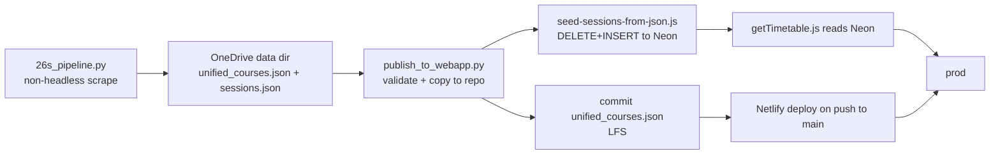

# Handoff — Scrape → Neon ingest → prod deploy (2026-07-27)

Branch: `dev` (webapp, `C:\Projects\tunniplaan`) — promoted to `main`, deployed to production.
Scraper: `C:\Projects\scrape_taltech_tunniplaan` on `dev`.

## 1. Current Task Objectives

- ✓ Run a full scrape of the TalTech 2026/2027 sügis ("26s") timetable
- ✓ Ingest the fresh sessions into Neon Postgres and verify fidelity
- ✓ If clean, merge `dev`→`main` and deploy to production, then verify prod
- ✓ Decide and commit the scraper circuit-breaker threshold
- ✓ Fix the contract test so it survives the denser dataset

## 2. Current Progress

### Completed this session
- **Full non-headless scrape**: 428/428 groups, 1032 courses, **65,703 sessions**, 0 permanent failures (~140 min). Log: `C:\Projects\scrape_taltech_tunniplaan\logs\scraping_20260727_115725.log`.
- **Publish**: `python publish_to_webapp.py` copied fresh `unified_courses.json` (+ `sessions.json`) from the OneDrive data dir into `C:\Projects\tunniplaan`. Validation passed (1032 courses / 428 groups / 65703 sessions, scraped `27.07.2026 14:18`).
- **Neon ingest**: `node scripts/seed-sessions-from-json.js` → `Rows in DB: 65703; rows in source: 65703` (exact match). Live-prod DELETE+INSERT window (see Risks).
- **Verification** (all green): contract test deep-equal over all 1032 courses; direct handler checks — one course `ITX0020` → 200/array(102), all courses → `limit_exceeded count=65703 limit=4000`, empty param → `[]`; active semester = `26s` "2026/2027 sügis", `is_active=true`, 65,703 rows.
- **Ship**: 2 commits on `dev` → fast-forwarded `origin/main` `4e1a55d..e083bde` (LFS blob 6.7 MB uploaded). Netlify prod deploy `ready` on `e083bde`.
- **Prod verification** at `https://taltech-tunniplaan.netlify.app`: function one-course → 200/array(102); limit path (200 courses) → `limit_exceeded count=18542`; empty → `[]`; deployed `unified_courses.json` → 1032 courses, scraped `27.07.2026 14:18`.
- **Scraper resilience**: `CONSECUTIVE_FAIL_LIMIT` 3 → 12 with rationale comment (`26s_pipeline.py:64`), committed `59f7462`, pushed to `tunniplaanScraping` `origin/dev`.
- **Docs**: CLAUDE.md "Data Updates" section corrected (ingest step documented; commit convention no longer says "session and unified courses").
- **Contract test fix**: count-aware batching (commit `f7210be`).

### Known working
- Production reads Neon and returns the fresh dataset; the 4000-session limit path prevents the old 502 at large course sets.
- Frontend metadata (1032 courses) and Neon session data (65,703) are consistent.

## 3. Key Context

| Item | Value |
|---|---|
| Prod site | `https://taltech-tunniplaan.netlify.app` (Netlify project `taltech-tunniplaan`, id `c37a8aa8-480f-475c-bdae-94eb239bd8b5`) |
| Prod commit | `e083bde` (main) |
| Function | `netlify/functions/getTimetable.js` — queries Neon `sessions` for active semester |
| Read role | `NEON_DATABASE_URL` = `webapp_ro` (read-only) |
| Write role | `NEON_SCRAPER_URL` = `scraper_rw`; both in gitignored `.env` |
| Ingest tool | `scripts/seed-sessions-from-json.js` (non-atomic dev script) |
| Verify tool | `scripts/contract-test-gettimetable.js` (uses `NEON_DATABASE_URL`) |
| Session limit | 4000/request (env `CALENDAR_SESSION_LIMIT`), returns `limit_exceeded` at HTTP 200 |
| Data density | ~63.7 sessions/course (65703/1032) — ~4× the old data |
| Scraper | `26s_pipeline.py`, run **non-headless** (see gotcha) |

### Data-refresh flow


### Gotchas
- **Scrape must run non-headless.** `--headless=new` silently breaks the "Kuupäevaline vaade" daily-view tab clickability for some groups (VDXR11/31/32) → "No daily timetable found", even though those groups have data. A headless run on 2026-07-27 tripped the circuit breaker at group 7/428.
- **`sessions.json` is gitignored** — it lives in Neon; only `unified_courses.json` is committed (LFS).
- **The ingest is non-atomic** (see Risks).

## 4. Key Findings

1. `scripts/seed-sessions-from-json.js:36` DELETEs then chunk-INSERTs (`CHUNK_SIZE=500`, line 10) as independent autocommit statements — **no transaction**. The header comment references a transactional production ingest "in the scraper repo" that **does not exist yet**.
2. `scripts/contract-test-gettimetable.js` originally used a fixed `BATCH_SIZE=50`; with ~4× denser data some alphabetical clusters exceeded 4000 sessions → handler returned `limit_exceeded` → `Array.isArray` assert failed (batch 300 held 5810). Fixed by count-aware batching keyed on `MAX_BATCH_SESSIONS=3500` (commit `f7210be`).
3. `netlify/functions/getTimetable.js:45` counts first and short-circuits to `limit_exceeded` before SELECTing rows — this is the 502 fix; it never builds a huge payload.
4. `26s_pipeline.py:64` — `CONSECUTIVE_FAIL_LIMIT` was 3 (too aggressive); now 12. The per-group auto-retry ladder recovers transient flakiness, so the circuit breaker only needs to catch systemic failure.
5. `publish_to_webapp.py` still warns "sessions.json 48.7 MB approaching Netlify's 50 MB limit" and prints a `git add sessions.json` suggestion — both **stale** post-Neon (sessions.json is not deployed/committed). The `70 group_sessions with null session_status` warning is benign (webapp renders null as `online`).

## 5. Incomplete Items (priority-ordered)

1. **(P2) Build a transactional production ingest** so live prod never sees a partial DELETE+INSERT window. Belongs in the scraper repo per the seed script's header, or as a Neon-side atomic swap (insert to staging table + rename, or a single `BEGIN…COMMIT` via `@neondatabase/serverless` Pool/Client over WebSocket).
2. **(P3) Update `publish_to_webapp.py`** (scraper repo) to drop the stale 50 MB warning and the `git add sessions.json` suggestion for the Neon architecture.
3. **(P3) Phase 2**: move `unified_courses.json` (~6 MB LFS) into Neon too.

## 6. Suggested Handoff Path

- Review: `netlify/functions/getTimetable.js`, `scripts/seed-sessions-from-json.js`, `scripts/contract-test-gettimetable.js`, `CLAUDE.md` "Data Updates".
- Verify prod anytime:
  ```bash
  curl -s "https://taltech-tunniplaan.netlify.app/.netlify/functions/getTimetable?courses=ITX0020" | head -c 120
  ```
- Re-verify data fidelity (needs `NEON_DATABASE_URL` from `.env`):
  ```bash
  export NEON_DATABASE_URL="$(grep -E '^NEON_DATABASE_URL=' .env | cut -d= -f2- | tr -d '\r')"
  node scripts/contract-test-gettimetable.js
  ```
- Recommended next action: implement the transactional ingest (Incomplete #1) before the next refresh.

## 7. Risks and Notes

- **Non-atomic live ingest**: running `seed-sessions-from-json.js` DELETEs the active semester's rows then re-INSERTs over ~1–2 min; live prod (`getTimetable.js` reads the same DB) sees partial/empty sessions during that window. Mitigated 2026-07-27 by running during summer break (near-zero traffic). It is idempotent/re-runnable (source of truth = `sessions.json` on disk). **Do not run during term-time traffic without the transactional ingest.**
- **Scraper headless trap**: never run the full scrape with `--headless` (see gotcha).
- **Credentials**: `NEON_*` URLs live only in the gitignored `.env`; never commit. Clockify creds live only in `C:\Projects\maj-shared\.env`.

## 8. Suggested First Step for the Next Agent

```bash
cd C:/Projects/tunniplaan && git checkout dev && git pull
# prod is healthy on e083bde; if starting the transactional-ingest work:
# read scripts/seed-sessions-from-json.js and design a BEGIN/COMMIT or staging-swap ingest.
```
