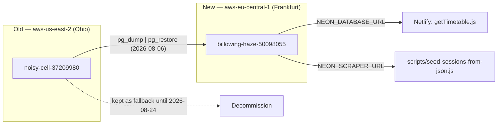

# Handoff: Neon Region Migration (Ohio → Frankfurt)

**Date**: 2026-08-06
**Branch**: `dev` (no code changes this session — infra-only)

## 1. Current Task Objectives

- [x] Diagnose why `tunniplaan`'s Neon project was in `aws-us-east-2` (Ohio) instead of a region near Estonia
- [x] Create a new Neon project pinned to `aws-eu-central-1` (Frankfurt)
- [x] Migrate schema + data (semesters, groups, courses, sessions) with verified row-count parity
- [x] Cut production (`NEON_DATABASE_URL` on Netlify, all contexts) over to the new project
- [x] Verify via contract test + live endpoint hit
- [ ] Decommission the old Ohio project — **deferred to 2026-08-24 by design**, see Incomplete Items

## 2. Current Progress

Completed this session:
- Root cause: `tunniplaan`'s Neon project was originally created via Neon MCP's `create_project` tool, which has no region parameter and defaults to `aws-us-east-2`. This is the same gap the `etl-ois-tagasiside` repo's Azure→AWS migration SOP already works around by using the raw Neon API instead.
- New project `billowing-haze-50098055` created in org `org-proud-art-61202466` ("Siyi"), region `aws-eu-central-1`, pg 17, via raw `POST /api/v2/projects` (personal `NEON_API_KEY` reused from `etl-ois-tagasiside/.env` — same org, so it authorizes across projects).
- Roles `scraper_rw` / `webapp_ro` recreated on the new project (fresh passwords) *before* restore, since `pg_dump`/`pg_restore` do not carry role definitions (roles are cluster-level, not per-database) — only the `GRANT` statements referencing them.
- `pg_dump -Fc` from old project → `pg_restore` into new project. Only the 2 expected benign `cloud_admin` `ALTER DEFAULT PRIVILEGES` errors — same pattern documented in the org's other Neon migrations.
- Row counts verified exact match: `semesters` 1/1, `groups` 0/0, `courses` 0/0, `sessions` 65703/65703 (groups/courses are legitimately empty in both — Phase 1 only seeds semesters+sessions; course metadata still ships via `unified_courses.json`).
- Local `.env` (`NEON_ADMIN_URL`, `NEON_SCRAPER_URL`, `NEON_DATABASE_URL`) updated to new project's connection strings.
- Netlify env var `NEON_DATABASE_URL` updated for **all contexts** via `netlify env:set` (confirmed exit 0, output redacted before logging to avoid the secret-echo issue previously flagged in `docs/260724-handoff-neon-phase1-deploy.md:49`).
- `node --env-file=.env scripts/contract-test-gettimetable.js` passed: 65,703/65,703 events deep-equal against the new project.
- Live endpoint spot-checked: `https://taltech-tunniplaan.netlify.app/.netlify/functions/getTimetable?courses=ITX0020` returns correct wire-format data from the new project.
- Scratchpad files containing plaintext credentials (project-creation API response, dump file) deleted after use.

Known working: production is fully live on the Frankfurt project right now. No further action needed for the app to function correctly.

## 3. Key Context

| Item | Value |
|---|---|
| Old project | `noisy-cell-37209980` — `aws-us-east-2` (Ohio) — **still running, untouched, fallback only** |
| New project | `billowing-haze-50098055` — `aws-eu-central-1` (Frankfurt) — **live in production** |
| Org | `org-proud-art-61202466` ("Siyi") |
| Netlify site | `taltech-tunniplaan` (project id `c37a8aa8-480f-475c-bdae-94eb239bd8b5`) |
| Roles | `scraper_rw` (read/write, used by `scripts/seed-sessions-from-json.js`), `webapp_ro` (read-only, used by `netlify/functions/getTimetable.js`) — both recreated fresh on the new project, passwords differ from the old project |



**Gotcha**: The Neon MCP write-mode auto-classifier blocks mutating `curl` calls (raw API project creation) even under a general "proceed" approval — it requires its own explicit per-call confirmation. Expect this on any future region-pin migration.

**Gotcha**: `pg_restore` output showing `relation "X" does not exist` on an immediately-following `run_sql` query without a schema prefix is a `search_path` session artifact from the dump replay, not missing data — re-query with `public.` prefix or check `SHOW search_path` (should read `"$user", public` at the database level).

## 4. Key Findings

1. `netlify/functions/getTimetable.js` and `scripts/seed-sessions-from-json.js` are the only two consumers of Neon connection strings in this repo (confirmed via grep for `NEON_DATABASE_URL|NEON_SCRAPER_URL`) — no other file needed updating for the cutover.
2. `db/roles.sql` is not idempotent against a fresh project in the order written — the `GRANT ... ON TABLE` lines fail until tables exist. Correct sequence for a from-scratch project: `CREATE ROLE` + `GRANT USAGE ON SCHEMA public` first, then `pg_restore` (which replays the original `GRANT ON TABLE`/`SEQUENCE` statements from the source dump).
3. `.env` in this repo (gitignored) is the single source of truth for `NEON_ADMIN_URL`/`NEON_SCRAPER_URL`/`NEON_DATABASE_URL` locally; Netlify only stores `NEON_DATABASE_URL`.

## 5. Incomplete Items

**Priority 1 — scheduled, not urgent**: Decommission the old Ohio project (`noisy-cell-37209980`) on or after **2026-08-24**, once confidence in the Frankfurt project is established. Action: delete via Neon console or `mcp__plugin_neon_neon__delete_project` — requires explicit user confirmation at that time, do not automate the deletion itself. Nothing else depends on the old project; it is pure standby.

A one-time cloud reminder routine (`trig_01Dpt5xffamn1TNxw95vHqz7`) fires 2026-08-24T06:00:00Z to surface this — it has no Neon MCP connector, so it can only report and ask, not delete.

## 6. Suggested Handoff Path

- Files to review: none — no code changed this session.
- Verify steps for the next agent (or future self): confirm `noisy-cell-37209980` is still listed in `mcp__plugin_neon_neon__list_projects` before deleting, and that `NEON_DATABASE_URL` in both `.env` and Netlify still points at `billowing-haze-50098055` (region should read `aws-eu-central-1`).
- Recommended next action: on/after 2026-08-24, ask the user to confirm deletion of the old project, then delete and update this repo's memory file `neon-region-migration-ohio-to-frankfurt.md` to reflect the old project is gone.

## 7. Risks and Notes

- **No rollback path once the old project is deleted.** Until 2026-08-24, if the Frankfurt project misbehaves, revert `NEON_DATABASE_URL` (both `.env` and Netlify) back to the Ohio connection strings — they still work, nothing there was touched.
- **Fresh role passwords**: the new project's `scraper_rw`/`webapp_ro` passwords are different from the old project's. Any external tooling (not found in this repo, but worth checking) hardcoding the old connection string would silently break.

## 8. Suggested First Step for the Next Agent

```bash
# Confirm old project still exists and new project is still the one in use, before any decommission work
grep NEON_DATABASE_URL /c/Projects/tunniplaan/.env
```
Then check today's date against 2026-08-24 before proceeding with deletion.
