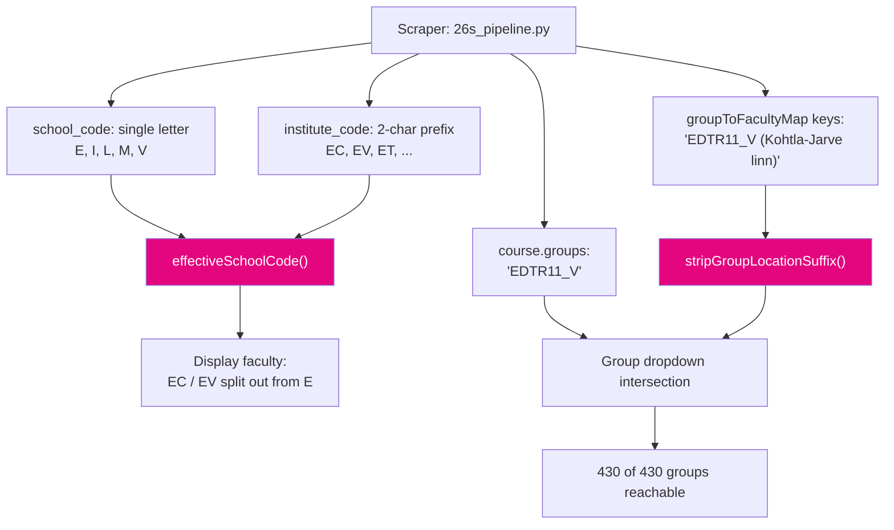

# 260824 Handoff — College faculty filters and ET/EN language pill

**Date**: 2026-08-24
**Branch**: `dev` (dev-first policy; promoted to `main` this session)
**Commit**: `47c1e4a` — "Split colleges into own faculties; strip group suffixes; ET/EN pill"
**Predecessor handoff**: [260824-handoff-scrape-refresh-college-faculties.md](260824-handoff-scrape-refresh-college-faculties.md)

---

## 1. Current Task Objectives

| # | Objective | Status |
|---|---|---|
| 1 | Kuressaare and Virumaa colleges appear as their own entries in the Teaduskond filter | ✓ |
| 2 | Selecting a college returns its courses (not zero) | ✓ |
| 3 | All 430 mapped student groups reachable through the group dropdown | ✓ |
| 4 | Replace the globe language button with an ET/EN segmented pill | ✓ |
| 5 | Verify in browser at `http://localhost:8000` | ✓ (user-confirmed: EV 78, EC 31) |
| 6 | Promote to `main` so Netlify builds production | ✓ |
| 7 | Fix `main.js:792` stale comment and hoist `groupMapCodeFor()` out of the loop | x — deferred, see §5 |

---

## 2. Current Progress

### Completed this session

- `effectiveSchoolCode(course)` added to [main.js](../main.js). Returns `EC`/`EV` when
  `institute_code` starts with those prefixes, else `course.school_code`. Eight call sites
  routed through it.
- `groupMapCodeFor(schoolCode)` maps `EC`/`EV` back to `E` for `groupToFacultyMap` lookups
  only, because that map is keyed on the parent letter.
- `stripGroupLocationSuffix(group)` normalises `groupToFacultyMap` keys to the bare code
  when `facultyToGroupsMap` is built.
- `FACULTY_INFO` gained `EC` and `EV` entries with Estonian and English names.
- Language toggle replaced: `index.html:31-33` markup, `main.css:107-139` styles,
  `updateLangPill()` in [main.js](../main.js). State carried on `aria-pressed`.
- [CLAUDE.md](../CLAUDE.md) — school-code section rewritten (it documented the replaced
  `institute_code.startsWith()` behaviour); group-suffix section marked handled.
- [README.md](../README.md) — added the `python -m http.server` caching gotcha to the
  "Static frontend only" section.

### Known working (verified)

| Faculty | Courses | Institutes | Groups |
|---|---|---|---|
| E | 371 | 18 | 182 |
| I | 181 | 13 | 86 |
| M | 175 | 7 | 73 |
| L | 104 | 8 | 46 |
| V | 81 | 2 | 22 |
| EV | 78 | 1 | 42 |
| EC | 31 | 1 | 10 |
| DOK | 9 | — | — |

- Teaduskond dropdown: 6 entries → 8.
- Groups reachable via some faculty: 370 → **430 of 430**.
- Dead-combination sweep: **461 faculty+group pairs checked, 0 returning zero courses.**
- `node --check main.js` → clean.

---

## 3. Key Context

### Tech stack

| Layer | Technology |
|---|---|
| Frontend | Vanilla JS, HTML5, CSS3 |
| Styling | Tailwind via CDN + `main.css` |
| Backend | Netlify function `netlify/functions/getTimetable.js` |
| Database | Neon Postgres, project `billowing-haze-50098055` (Frankfurt) |
| Course data | `unified_courses.json`, Git LFS |
| Deploy | Netlify, auto-deploy on push to both `dev` and `main` |

### The two-representation problem

The scraper and the webapp disagree about faculty and group identity in two independent
ways. Both are now handled in `main.js`, neither is fixed at the source.



### Gotchas

1. **`school_code` is never `EC` or `EV`.** No course carries those values. Any comparison
   against `activeFilters.school` must use `effectiveSchoolCode(course)`, or a college
   filter silently returns zero. This was the actual bug that survived the first fix
   attempt — the dropdown offered a value the predicate could not match.
2. **`python -m http.server` caches.** It sends `Last-Modified` but no `Cache-Control`, so
   browsers apply heuristic freshness. Two "the fix didn't work" reports this session were
   both stale JS, not code. Verify with `curl`, not the browser.
3. **`groupToFacultyMap` stays keyed on the parent letter.** Do not "fix" this by keying it
   on `EC`/`EV` — `groupMapCodeFor()` exists precisely to bridge it.

---

## 4. Key Findings

1. **`main.js:621`** — `applyAllFiltersAndRender` compared the raw `course.school_code`.
   This is the line that made `EC`/`EV` return zero courses even after the dropdown,
   institute list, card label, and deep-link paths were all converted. Derived-value
   refactors need a `grep` sweep of the original field name, not a call-site walk.
2. **`grep -n "school_code" main.js`** now returns 5 hits. Only line 198 (inside the helper)
   reads it for a comparison; 582 and 1764 are existence guards. No comparison bypasses
   `effectiveSchoolCode()`.
3. **Stripping group suffixes is collision-free.** 430 suffixed keys reduce to 430 distinct
   bare keys, and no bare key maps to two different faculties. Verified before the edit.
4. **12 IT-coded courses moved to Virumaa Kolledž**: `IDU1550, ITB2430, ITB2431, ITB8802,
   ITB8805, ITB8810, ITB8824, ITB8828, ITB8832, ITB8833, ITI0207, MMA5070`. They carry
   `school_code=I` but `institute_code=EV`. Infotehnoloogia went 193 → 181. Correct, but a
   visible change for anyone comparing faculty counts month-over-month.
5. **Tartu Kolledž was not promoted.** 61 courses, `institute_code` prefix `ET`, still under
   Inseneriteaduskond. Deliberate — only Kuressaare and Virumaa became faculties.
6. **`DOKTOR` and `VABA`** appear in `course.groups` (432 unique) but not in
   `groupToFacultyMap`. Pseudo-groups, correctly absent from the faculty-filtered dropdown.
   The 430 figure counts real student groups.
7. **`main.js:1391`** — a stray top-level `facultyToGroupsMap = new Map();` sits between two
   function declarations. Pre-existing, harmless (runs at script-eval, before
   `postProcessUnifiedData`), but confusing to read. Not touched this session.

---

## 5. Incomplete Items

Priority-ordered.

1. **Stale comment, `main.js:792`** — `// Use first character of institute_code to get
   school name from FACULTY_INFO`. The line below now calls `effectiveSchoolCode(course)`.
   Cosmetic; deliberately deferred to avoid untested edits at close time.
2. **`groupMapCodeFor(schoolCode)` recomputed per course**, `main.js:1447`. It is invariant
   across the loop. Hoist above `allCourses.forEach`. ~1000 redundant calls per filter
   change; not measurable, but it reads as a mistake.
3. **School codes remain duplicated across two repos.** The scraper's `FACULTY_INFO` in
   `26s_pipeline.py` and `main.js`'s own `FACULTY_INFO` must stay in sync manually. A new
   scraper-side code without a webapp entry falls back to the raw letter.
4. **Consider fixing the group-suffix mismatch at the source.** `stripGroupLocationSuffix()`
   is a webapp-side workaround. The scraper could emit bare keys in `groupToFacultyMap`,
   which would make the helper dead code. Cross-repo change, needs the data contract updated.
5. **Orphan statement `main.js:1391`** — remove or move into a function.

---

## 6. Suggested Handoff Path

### Files to review first

| File | Why |
|---|---|
| [main.js](../main.js):196-210 | The three helpers everything else depends on |
| [main.js](../main.js):621 | The filter predicate — the bug that survived one fix round |
| [main.js](../main.js):1429-1470 | `updateDependentFilters`, both sub-filter builds |
| [CLAUDE.md](../CLAUDE.md):181-205 | Current architecture notes on both mismatches |

### Verify steps

```bash
node --check main.js
python -m http.server 8000   # then hard-reload: Ctrl+Shift+R
```

Then in the UI: select `Virumaa Kolledž` → expect 78 courses and 42 groups; select
`Kuressaare Kolledž` → expect 31 courses and 10 groups.

To re-run the dead-combination sweep after any data refresh, re-derive counts directly from
`unified_courses.json` with the `effectiveSchoolCode` logic rather than trusting the UI.

### Recommended next action

Fix items 1 and 2 in §5 together — both are in `main.js`, both are one-line, neither changes
behaviour. Run `node --check` and one browser pass, then commit as a tidy-up.

---

## 7. Risks and Notes

- **Risk — silent zero-result filters.** Any future faculty-related comparison written
  against `course.school_code` will produce an empty result set for colleges with no error,
  no console warning, and a populated dropdown. This failure mode is invisible in code
  review. Grep for `school_code` after touching filter logic.
- **Risk — data refresh may change the counts.** The 78/31 figures come from the 2026-08-24
  scrape. A new scrape that reassigns `institute_code` values will move courses between
  faculties without any code change. Re-verify after every ingest.
- **Note — Netlify deploys both branches.** Pushing `dev` builds
  `dev--taltech-tunniplaan.netlify.app`; pushing `main` builds production. Neither needs a
  build hook. Verified 2026-08-24. The "Netlify: Deploy Dev Branch" VS Code task is broken
  (revoked hook, HTTP 404) and fails silently.
- **Note — line endings.** `CLAUDE.md` is CRLF, `README.md` and `index.html` are LF. A
  whole-file rewrite in Python with the wrong `newline=` flips them and turns a 20-line diff
  into a 500-line one. Check `git diff --stat` against `--ignore-all-space` before committing.
- **Note — `unified_courses.json` is Git LFS.** Untouched this session. Run `git lfs pull`
  before any work that reads it.

---

## 8. Suggested First Step for the Next Agent

```bash
cd C:/Projects/tunniplaan
git checkout dev && git pull
grep -n "school_code" main.js          # expect 5 hits, none a bare comparison
sed -n '790,796p' main.js              # the stale comment from §5 item 1
sed -n '1443,1450p' main.js            # groupMapCodeFor() inside the loop, §5 item 2
```

Fix both, `node --check main.js`, hard-reload `http://localhost:8000`, confirm
`Virumaa Kolledž` still shows 78 courses, then commit.
