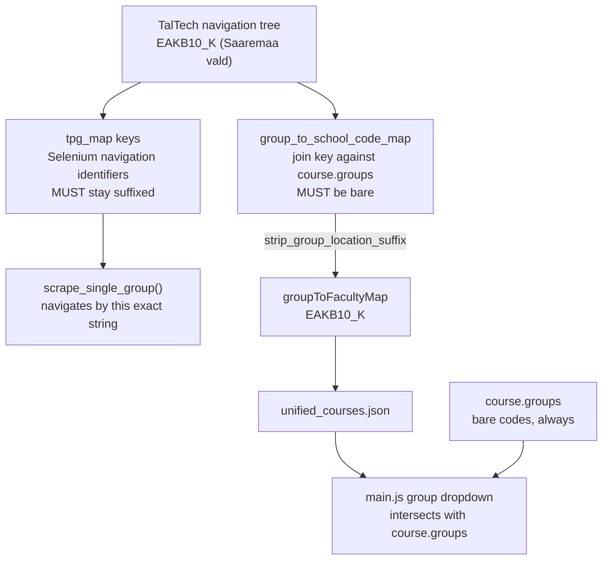

# Handoff: group-suffix source fix and cross-repo doc sync

Date: 2026-08-24
Repos: `C:\Projects\tunniplaan` (webapp), `C:\Projects\scrape_taltech_tunniplaan` (scraper)
Branches: both on `dev`, both 1 commit ahead of `main` before this handoff commit

Continues `docs/260824-handoff-college-faculty-filters.md`. That handoff closed with a
three-item backlog; this session cleared all three.

## 1. Current Task Objectives

- [x] Clear nit 1: stale comment at `main.js:792` describing the removed `institute_code[0]` lookup
- [x] Clear nit 2: `groupMapCodeFor(schoolCode)` recomputed inside a per-course loop at `main.js:1443`
- [x] Stop the temporary no-cache dev server from the previous session
- [x] Fix the group location-suffix mismatch **at source** in the scraper, not only in the webapp
- [x] Keep the webapp's `stripGroupLocationSuffix()` as a deliberate defensive duplicate
- [x] Commit and push both repos to `dev` without triggering a Netlify build
- [x] Sync cross-repo documentation that described the pre-`effectiveSchoolCode()` webapp

## 2. Current Progress

### Completed this session

| Repo | Commit | Content |
|---|---|---|
| scraper | `7584856` | `strip_group_location_suffix()` + collision guard + 5 tests + data-contract update |
| webapp | `b812988` | comment fix and loop hoist in `main.js`; `[skip ci]` in the subject |
| both | this handoff commit | `CLAUDE.md` cross-repo doc sync |

### Known working

- Scraper suite: **59 passed** (`python -m pytest tests/ -v`)
- Group reachability: **430 of 430** (was 370 before 2026-08-24)
- Faculty dropdown: 8 entries - E 371, I 181, M 175, L 104, V 81, EV 78, EC 31, DOK 9
- Dead-combination sweep: 461 faculty+group pairs, 0 returning zero courses
- Production (`main`, `47c1e4a`) is unaffected by this session; `dev` carries the tidy commit only

## 3. Key Context

### Tech stack

| Layer | Technology |
|---|---|
| Frontend | Vanilla JS SPA, Tailwind via CDN |
| Backend | Netlify serverless function (`netlify/functions/getTimetable.js`) |
| Session data | Neon Postgres, project `billowing-haze-50098055` (Frankfurt) |
| Course metadata | `unified_courses.json`, Git LFS, ~6 MB |
| Scraper | Python + Selenium, `26s_pipeline.py` |

### The two-representation problem



The same string serves two incompatible roles. Stripping the addressing key breaks
scraping; not stripping the join key silently shortens the dropdown.

### Gotchas

- **`python -m http.server` sends `Last-Modified` but no `Cache-Control`.** The browser
  caches heuristically and serves stale `main.js`. A code fix will appear not to work.
  Verify with `curl http://localhost:8000/main.js | grep -c <marker>` before editing again,
  and hard-reload with Ctrl+Shift+R.
- **`[skip ci]` in a commit subject suppresses the Netlify branch deploy.** Read from the
  latest commit message. Not verifiable from the repo - this site has no `netlify.toml`;
  build config lives in the Netlify UI.
- The scraper repo (`siyi-ma/tunniplaanScraping`) has **no Netlify site attached**. Pushing
  it can never trigger a deploy.

## 4. Key Findings

1. **`26s_pipeline.py:210-224`** - `GROUP_LOCATION_SUFFIX_RE` and
   `strip_group_location_suffix()`. Non-string inputs pass through unchanged rather than
   raising, because the builder feeds it dict keys mid-scrape.
2. **`26s_pipeline.py:1096-1113`** - the map builder now strips, detects collisions
   (warns and keeps the first), and logs `entries / tpg_map groups / suffixed count`.
   It is the **only** call site; `tpg_map` itself is untouched.
3. **`tests/test_group_suffix_strip.py:69`** - `assert seen_groups` guards against a
   vacuous pass. The first version of this test walked `block["groups"]`, but the real
   shape is `block["programmes"][*]["groups"]`; it found 0 groups and passed green.
4. **`main.js:1443`** - `groupMapCodeFor(schoolCode)` hoisted out of `allCourses.forEach`.
   `schoolCode` is loop-invariant, so this was ~1030 redundant calls per filter change.
5. **`scrape_taltech_tunniplaan/CLAUDE.md:188`** (now corrected) claimed the webapp filters
   via `institute_code.startswith(school_code)` at `main.js:1407`. That code was replaced by
   `effectiveSchoolCode()` earlier the same day. **Cross-repo docs cannot be caught by either
   repo's tests** - repo A describing repo B wrongly fails nothing.
6. **The webapp's `stripGroupLocationSuffix()` is now redundant but retained.** The committed
   `unified_courses.json` still holds suffixed keys; only the next scrape-and-publish makes
   them bare. Removing the webapp helper before that publish would re-break 60 groups.

## 5. Incomplete Items

Priority-ordered:

1. **Verify the `[skip ci]` token actually suppressed the deploy.** Check Netlify ->
   Deploys for `taltech-tunniplaan`. Worst case a harmless `dev--` branch preview built.
2. **`dev` is ahead of `main` in both repos.** Neither the tidy nor the scraper fix has
   been promoted. Promotion of the webapp `dev` triggers the production build.
3. **The scraper fix is inert until the next scrape.** `strip_group_location_suffix()`
   changes nothing about the currently deployed data. Confirm bare keys after the next
   `26s_pipeline.py` run and `publish_to_webapp.py`.
4. **Consider removing `stripGroupLocationSuffix()` from `main.js`** once a post-fix
   `unified_courses.json` is committed - but only then, and only after confirming
   `groupToFacultyMap` keys are bare in the committed file.

## 6. Suggested Handoff Path

Files to review first:

- `C:\Projects\scrape_taltech_tunniplaan\26s_pipeline.py:207-224` and `:1096-1113`
- `C:\Projects\tunniplaan\main.js` - `effectiveSchoolCode()`, `groupMapCodeFor()`, `stripGroupLocationSuffix()`
- `C:\Projects\scrape_taltech_tunniplaan\docs\data-contract.md:44-51`

Verify steps:

```bash
cd C:/Projects/scrape_taltech_tunniplaan
python -m pytest tests/ -v                           # expect 59 passed
python -m pytest tests/test_group_suffix_strip.py -v # expect 5 passed

cd C:/Projects/tunniplaan
node scripts/contract-test-gettimetable.js           # Neon wire-format contract
```

Recommended next action: confirm the Netlify deploy state (item 1), then decide whether to
promote `dev` to `main` in either repo.

## 7. Risks and Notes

- **Do not apply `strip_group_location_suffix()` to `tpg_map`.** Those keys are what
  `scrape_single_group()` navigates by. Stripping them breaks the scrape with no local
  test failure - the tests cover the helper and the map, not the Selenium path.
- **Never compare `course.school_code` to a faculty filter value.** No course ever carries
  `school_code` `EC` or `EV`; the scraper files both colleges under `E` (and `I` for 12
  Virumaa IT courses). Every comparison must route through `effectiveSchoolCode()`. This
  exact bug survived one fix round because the display paths were converted and the filter
  predicate at `main.js:621` was missed. After touching filter logic, run
  `grep -n "school_code" main.js` and check every hit.
- **Line endings differ between the two CLAUDE.md files.** `tunniplaan/CLAUDE.md` is CRLF;
  `scrape_taltech_tunniplaan/CLAUDE.md` is LF. A whole-file rewrite with the wrong
  `newline=` flips the convention and produces a several-hundred-line phantom diff. Verify
  with `git diff --stat` against `git diff --stat --ignore-all-space` - the two must match.
- **The Neon ingest is not atomic.** `scripts/seed-sessions-from-json.js` does a DELETE
  followed by chunked inserts with no enclosing transaction, leaving a 1-2 minute window of
  partial live data. Run during low traffic.
- **Build-hook URLs are secrets.** Get them from the Netlify UI; never commit them.

## 8. Suggested First Step for the Next Agent

```bash
cd C:/Projects/tunniplaan
git log --oneline -3
git rev-list --left-right --count main...dev   # left must be 0 for a fast-forward promotion
```

Then open the Netlify Deploys page for `taltech-tunniplaan` and confirm whether the
`b812988` push produced a build or was skipped by `[skip ci]`.
