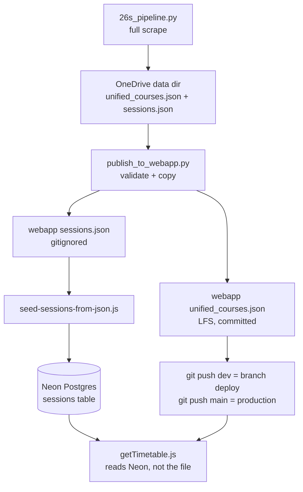

# Handoff — Scrape refresh + regional-college faculty mapping (2026-08-24)

Webapp: `C:\Projects\tunniplaan` on `dev`, promoted to `main` (`5c3c491`), deployed to production.
Scraper: `C:\Projects\scrape_taltech_tunniplaan` on `dev`, promoted to `main` (`75dac41`).

## 1. Current Task Objectives

- ✓ Run a full scrape of the TalTech 26s timetable and refresh the live data
- ✓ Root-cause the group-count drop that appeared during the refresh (428 → 399)
- ✓ Add the two new regional-college faculties to the scraper's `FACULTY_INFO`
- ✓ Unblock `publish_to_webapp.py`, which hard-failed on valid 50.3 MB data
- ✓ Promote both repos `dev` → `main` and verify production

## 2. Current Progress

### Completed this session
- **Test scrape then full scrape** (non-headless, per project policy). Full run
  14:28–16:43, log `logs/scraping_20260824_142813.log`; 430/430 groups, 0 permanent failures.
- **Neon ingest** of the fresh sessions ran immediately after the scrape (accepted the
  ~1–2 min partial-data window on prod). 66,846 rows.
- **Root-caused a silent 31-group drop** and fixed it (see §4.1). Regenerated the
  transform in 4.8 s with `--transform-only` (log `scraping_20260824_170544.log`) —
  no re-scrape needed.
- **Confirmed no second ingest was required**: `sessions.json` was byte-identical
  (sha256 `7f8ec832…`) before and after the `FACULTY_INFO` change, so Neon stayed correct
  and prod took only one blip all session.
- **Removed the stale 50 MB publish gate** (see §4.2).
- **Added `tests/test_faculty_coverage.py`** — 3 tests; suite went 51 → 54, all passing.
- **Docs corrected** across both repos: scraper `CLAUDE.md`, `README.md`,
  `docs/data-contract.md`; webapp `CLAUDE.md`, `README.md`.
- **Shipped**: scraper `cb3b187..75dac41` → `main`; webapp `e083bde..5c3c491` → `main`.
  Production deploy `ready` on `5c3c491`.

### Known working (verified, not assumed)

| Check | Result |
|---|---|
| Contract test (`scripts/contract-test-gettimetable.js`) | `CONTRACT OK` — all 66,846 events deep-equal, 1030 courses |
| Prod `unified_courses.json` | 1030 courses, `groupToFacultyMap` 430, scraped `24.08.2026 17:05` |
| Prod `school_code` spread | `E`468 `I`193 `M`175 `L`104 `V`81 `DOK`9 — **0 null** |
| Prod `getTimetable?courses=SKK1110,ITI0102` | 376 events (SKK1110 = 8), HTTP 200 |
| Prod `getTimetable?courses=` | `[]` |
| Scraper suite | 54 passed |

## 3. Key Context

| Item | Value |
|---|---|
| Prod site | `https://taltech-tunniplaan.netlify.app` (project id `c37a8aa8-480f-475c-bdae-94eb239bd8b5`) |
| Dev site | `https://dev--taltech-tunniplaan.netlify.app` (branch deploy) |
| Prod commit | `5c3c491` |
| Data dir (scraper output) | `C:\Users\siyima\OneDrive - Tallinna Tehnikaülikool\M_õppetöö\TunniplaaniAI\26s\data` |
| Ingest tool | `scripts/seed-sessions-from-json.js` (needs `NEON_SCRAPER_URL`) |
| Dataset | 1030 courses · 66,846 sessions · 430 groups |
| Previous dataset | 1032 courses · 65,703 sessions · 428 groups (2026-07-27) |

### Data-refresh flow



### Gotchas
- **Deploys are automatic from GitHub.** Pushing `dev` or `main` deploys. The
  "Netlify: Deploy Dev Branch" VS Code task is **broken** — its build hook was revoked
  and returns HTTP 404 (only one hook remains on the site, for `main`).
- `sessions.json` is git-ignored and must never be committed; only `unified_courses.json` is.
- Scrapes must run **non-headless** — headless silently fails daily-view for some groups.
- The Neon ingest is DELETE + chunked inserts with **no transaction**: it exposes a
  1–2 min partial-data window on the live site.
- Scraper `.py` files are LF; the scraper `README.md` is **CRLF** and the webapp
  `CLAUDE.md` is **CRLF**. Whole-file rewrites on Windows silently convert. Read and
  write with `newline=''` and verify with `git diff -w --stat`.

## 4. Key Findings

1. **Silent 31-group drop — root cause.** TalTech promoted `KURESSAARE KOLLEDŽ` (7 groups)
   and `VIRUMAA KOLLEDŽ` (24 groups) from children of `INSENERITEADUSKOND` to top-level
   blocks in the navigation tree — 7 blocks against 6 `FACULTY_INFO` entries.
   `get_faculty_info()` (`26s_pipeline.py:198`) returns `{'code': None}` for an unknown
   name, and the `group_to_school_code_map` builder (`26s_pipeline.py:~1069`) skips falsy
   codes. All 31 groups were dropped from `groupToFacultyMap` (428 → 399) **with no
   exception and nothing logged**. Fixed at `26s_pipeline.py:189+`; map is now 430.

2. **Stale 50 MB publish gate.** `publish_to_webapp.py` hard-errored on 50.3 MB of valid
   data against Netlify's function-bundle cap. Verified obsolete on three legs:
   `.gitignore:16` ignores `sessions.json`, no `netlify.toml` exists, and
   `getTimetable.js:1` imports only `@neondatabase/serverless` and never reads the file.
   Re-anchored to the real consumer (the ingest's in-memory parse) as a 75 MB **warning**.

3. **Both colleges map to `E`, deliberately.** Kuressaare courses carry `institute_code`
   `EC` and Virumaa `EV`. The webapp's institute filter uses
   `institute_code.startsWith(schoolCode)` (`main.js:1407`), and `main.js:180-187` holds
   its own hardcoded `FACULTY_INFO`. A new code would have orphaned the college courses
   and required a coordinated webapp change; `E` restores exactly the pre-2026-08-24
   behaviour with no `main.js` edit.

4. **The fix changed only `groupToFacultyMap` — by design.** Course `school_code` spread is
   identical before and after, because `26s_pipeline.py:~728` resolves a course's faculty
   by looking up **bare** group codes in `tpg_map`, whose keys are **suffixed**. That lookup
   never hits, so college courses already derived `E` from `institute_code[0]`.
   `sessions.json` was likewise untouched.

5. **Pre-existing bare-vs-suffixed group-name mismatch.** `groupToFacultyMap` keys carry a
   location suffix (`EAKB10_K (Saaremaa vald)`) while `course.groups` and
   `group_sessions[].group` use bare codes (`EAKB10_K`). `main.js:1414-1416` intersects the
   two, so suffixed entries never match. Functional dropdown groups are therefore 370 both
   before and after this fix, and **60 groups are unreachable**. This predates the college
   change — the fix raised map orphans 29 → 60 only by adding 31 correctly-mapped-but-
   suffixed entries. Measured: all 60 orphans are suffixed, and all 60 bare forms already
   appear in `course.groups`, so stripping the suffix would take the dropdown 370 → 430.

6. **A correction to carry forward.** An earlier note in this session recorded 440 events
   for `SKK1110,ITI0102`. The correct figure is **376** (SKK1110 = 8, ITI0102 = 368),
   confirmed against `sessions.json` directly and by the contract test's deep-equal over
   all 66,846 events.

## 5. Incomplete Items (priority-ordered)

1. **Bare-vs-suffixed group names (finding 5)** — 60 groups unreachable in the dropdown, and
   the fix is well-characterised: strip the ` (Location)` suffix when building
   `groupToFacultyMap` in the scraper. All 60 bare forms are already present in
   `course.groups`, so this takes the dropdown 370 → 430 with no webapp change. Confirm
   nothing else keys on the suffixed form first.
2. **Non-transactional Neon ingest** — still a 1–2 min partial-data window per refresh.
   Wants `BEGIN/COMMIT` or a staging-table swap in `scripts/seed-sessions-from-json.js`.
3. **Revoked dev build hook** — either recreate it in the Netlify UI and update
   `.vscode/tasks.json`, or delete the broken task (deploys are automatic regardless).
4. **69 `group_sessions` with null `session_status`** — warned by the publish validator every
   run; the webapp renders them as `online`. Decide whether that default is correct.
5. **`unified_courses.json` → Neon (Phase 2)** — would retire the last LFS data file.

## 6. Suggested Handoff Path

Files to review, in order:
1. `26s_pipeline.py:189-207` — `FACULTY_INFO` and `get_faculty_info()`
2. `tests/test_faculty_coverage.py` — the guard and why it is a one-way set difference
3. `publish_to_webapp.py:25-35` and `:100-105` — the re-anchored size threshold
4. `docs/data-contract.md` — now describes the Neon reality, not the bundled-file one
5. `main.js:1407` and `main.js:1414-1416` — the institute filter and the group mismatch

Verify steps:

```bash
cd C:\Projects\scrape_taltech_tunniplaan && python -m pytest tests/ -q   # expect 54 passed
cd C:\Projects\tunniplaan && node scripts/contract-test-gettimetable.js  # expect CONTRACT OK
```

Recommended next action: item 1 in §5 — it is the only outstanding issue that users can see.

## 7. Risks and Notes

- **Non-atomic ingest**: `seed-sessions-from-json.js` DELETEs then re-INSERTs live production
  rows with no transaction. Run it during low traffic and re-verify with the contract test.
- **Silent-failure class**: the `FACULTY_INFO` bug produced no error at all. Any new
  "unknown key → falsy default → filtered out" path in this pipeline will behave the same
  way. `tests/test_faculty_coverage.py` covers only the faculty case.
- **Do not commit `sessions.json`** (52.8 MB, git-ignored). `git add -A` in the webapp repo
  is safe today only because `.gitignore` catches it.
- **Build-hook URLs are secrets** and live in the git-ignored `.vscode/tasks.json`
  (`.gitignore:1` covers `.vscode/`). Do not move them into a tracked file.
- **Line endings**: see §3 Gotchas. Three of the files touched this session are CRLF.
- **Scrape non-headless**: a headless run silently fails daily-view for some groups (e.g.
  VDXR) and can abort the whole run.

## 8. Suggested First Step for the Next Agent

Production is healthy on `5c3c491`; both repos are on `dev`, level with `main`. To start
the group-name normalisation (§5 item 1), first measure the blast radius:

```bash
cd C:\Projects\tunniplaan
python -c "import json; d=json.load(open('unified_courses.json',encoding='utf-8')); m=set(d['groupToFacultyMap']); g={x for c in d['courses'] for x in c.get('groups',[])}; print('map',len(m),'course-groups',len(g),'intersect',len(m&g),'orphans',len(m-g))"
```

Then grep `main.js` for every read of `groupToFacultyMap` before changing the key format.
