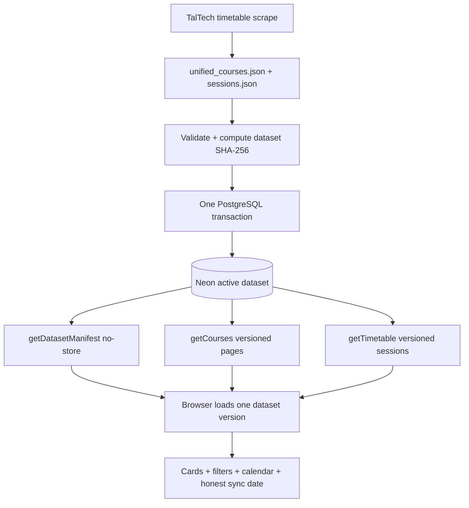

# Handoff Document — TalTech Tunniplaan
**Date**: 2026-08-29
**Branch**: `dev` (active working branch); `main` is production
**Repo**: https://github.com/siyi-ma/tunniplaan
**Live app / service**: https://taltech-tunniplaan.netlify.app

---

## 1. Current Task Objectives

- ✓ Determine whether Neon-only timetable ingestion updates the live application without a Netlify deployment.
- ✓ Identify why the top-right synchronization date remains deployment-coupled.
- ✓ Design a long-term Phase 2 architecture where course metadata, group mappings, semester metadata, sessions, and sync date are served consistently from Neon.
- ✓ Write a self-contained specification for a downstream agent.
- ✓ Write a loop-engineered, verifiable implementation plan following the repository's `.superpowers/sdd/` task brief/report/review pattern.
- x Obtain an independent agent review of the specification and implementation plan.
- x Apply accepted review amendments and receive user approval to begin implementation.
- x Implement Phase 2. No code, database, Netlify, or scraper behavior changed this session.

---

## 2. Current Progress

### Completed this session

- Traced the live data path: `main.js` loads course/filter data from static `unified_courses.json`, while `netlify/functions/getTimetable.js` queries Neon sessions at runtime.
- Confirmed `index.html` performs a second static JSON fetch solely for `scraping_datetime`, so Neon session ingestion alone cannot update the displayed sync date.
- Inspected the existing Neon schema, current session ingest helper, scraper publishing workflow, scraper data contract, webapp tests, and prior Phase 1 SDD artifacts.
- Measured the current dataset: 1,030 courses, 430 mapped groups, 6,687,128 raw bytes, and 5,168,251 compact JSON bytes.
- Verified from current Netlify documentation that buffered Function responses are limited to 6 MB; selected a bounded paged-course API rather than one near-limit full envelope.
- Created `docs/superpowers/specs/260829-neon-phase2-live-dataset.md` with the data model, atomic ingest, API, frontend, cache/version, fallback, acceptance, rollout, and rollback contracts.
- Created `docs/superpowers/plans/260829-neon-phase2-live-dataset.md` with an SDD controller protocol, separate API/frontend branch topology, twelve implementation tasks, review/fix loops, evidence gates, staged deployment, and cleanup gate.
- Structurally verified both documents: balanced Markdown fences, no replacement characters, no trailing whitespace, required draft/review sections, complete task numbering, and only the intended untracked files.

### Known working

- Existing application behavior remains untouched.
- Existing `getTimetable` unit tests and architecture were inspected, not changed.
- Both new documents cross-reference the same Phase 2 contracts and preserve `unified_courses.json` as a temporary rollback artifact.
- Git branch is `dev`, synchronized with `origin/dev` at session snapshot; HEAD was `2885c61` before close-session artifacts.

---

## 3. Key Context

### Tech stack

| Layer | Technology |
|---|---|
| Frontend | Vanilla JavaScript, HTML, CSS, Tailwind CDN |
| Runtime backend | Netlify Functions, Node.js CommonJS, `@neondatabase/serverless` |
| Database | Neon Postgres; `semesters`, `groups`, `courses`, `sessions` |
| Producer | Python/Selenium scraper in `C:\Projects\scrape_taltech_tunniplaan` |
| Current metadata transport | `unified_courses.json`, Git LFS, Netlify static asset |
| Current session transport | Neon `sessions` queried by `getTimetable.js` |
| Tests | Node built-in test runner and Python pytest |
| Execution method | `.superpowers/sdd/` task briefs, reports, commit-range reviews, fix loops |

### Architecture / hierarchy



The manifest supplies `dataset_version`. Every larger request includes that version,
which changes the cache key after each successful ingest. Course pages use a fixed size
of 200, with a project ceiling of 4.5 MiB per serialized response. Production ingestion
replaces semester rows inside one transaction and verifies counts before commit.

### Important configuration / gotchas

- `NEON_SCRAPER_URL` is write-capable and belongs only in the scraper environment.
- `NEON_DATABASE_URL` is read-only (`webapp_ro`) and is the only database credential available to Netlify Functions.
- The existing `scripts/seed-sessions-from-json.js` is non-atomic and is explicitly not the planned daily production ingest.
- The API manifest, course page, and versioned calendar SQL must use version-consistent statement snapshots; separate unguarded queries can straddle an ingest commit.
- Static fallback must disable calendar retrieval because old static courses can mismatch current Neon sessions.
- The current `.gitattributes` has a broad `*.json` LFS rule; `git lfs ls-files` includes `package.json`, `package-lock.json`, and `unified_courses.json`. Cleanup must not blindly remove or rewrite this rule.
- No production mutation is authorized by the drafts. Task 11 contains a hard user checkpoint before DDL, ingest, merge, push, or production deployment.

---

## 4. Key Findings

1. The current split architecture is the reason Neon-only ingest only refreshes calendar sessions. Course cards, filters, semester information, and sync date remain static; see `docs/superpowers/specs/260829-neon-phase2-live-dataset.md:38`.
2. A single full course-envelope Function is not a durable design. The current compact payload is already 5,168,251 bytes against Netlify's documented 6 MB buffered limit; see the specification at line 54 and pagination decision around line 115.
3. Dataset versioning must cover both source artifacts, because cards and calendar must move together. The draft hashes raw `unified_courses.json`, a NUL separator, and raw `sessions.json`; see the specification around line 136.
4. Atomicity is an operational requirement, not optional hardening. The current helper exposes partial session data during delete/chunked insert; the new contract verifies all row counts before transaction commit; see the specification at line 177.
5. Cache invalidation should be data-version-driven. A `no-store` manifest plus versioned course/calendar URLs makes new ingests visible without deploys or cache-purge API calls; see the API contracts at line 230.
6. Rollout must keep additive APIs separable from frontend cutover. The implementation plan defines `phase2-api` and descendant `phase2-frontend` branches at line 97, then gates production stages in Task 11 at line 763.
7. The plan is deliberately not ready for implementation until another agent reviews it. The final whole-change review protocol is at line 880, and both files remain `Draft — pending review`.

---

## 5. Incomplete Items (priority order)

1. Dispatch a separate review-only agent to audit both draft documents against the current webapp and scraper repositories. The reviewer must not implement or mutate files during the first pass.
2. Require the reviewer to return severity-ranked findings with exact document/code references, identify contradictions or unverifiable commands, and propose narrow amendments.
3. Present review findings to the user. Apply only accepted changes to the specification and plan, preserving draft status until approval.
4. After review approval, initialize the Phase 2 SDD ledger and execute Task 0 only. Do not jump directly to database or endpoint implementation.
5. Complete Tasks 1–10 with per-task independent reviews before requesting Task 11 production authorization.
6. Keep Task 12 cleanup deferred through at least two successful ingests and 48 hours; retaining fallback through the two-week high-change period is preferred.

---

## 6. Suggested Handoff Path

**Files to review first:**

- `docs/superpowers/specs/260829-neon-phase2-live-dataset.md` — authoritative proposed behavior, data/API contracts, acceptance criteria, and rollback gates.
- `docs/superpowers/plans/260829-neon-phase2-live-dataset.md` — downstream execution order, SDD loop, branch topology, verification commands, and production checkpoints.
- `AGENTS.md` — repository-specific constraints, particularly static/course versus Neon/session behavior.
- `netlify/functions/getTimetable.js` and `tests/functions/getTimetable.test.js` — current runtime session contract and caching.
- `db/schema.sql` and `scripts/seed-sessions-from-json.js` — current schema and known non-atomic ingest behavior.
- `C:\Projects\scrape_taltech_tunniplaan\docs\data-contract.md` and `publish_to_webapp.py` — producer contract and current file-copy publication flow.

**Verify first:**

1. Run `git status --short` and confirm only the spec, plan, and this handoff are untracked before close-session commit.
2. Confirm both drafts still say `Draft — pending review`.
3. Recompute current raw/compact/page payload sizes if `unified_courses.json` has changed since 2026-08-29.
4. Confirm current Neon schema/count state through read-only queries; do not rely on historical handoff claims that `courses`/`groups` are empty.

**Recommended next action:**

1. Call a separate agent with a review-only brief covering both repositories and both draft files.
2. Ask it to assess correctness, completeness, hidden race conditions, transaction feasibility, API payload/Netlify constraints, testability, task dependencies, rollout safety, and whether every acceptance criterion has an owning task.
3. Require output in three sections: findings ordered by severity, unanswered questions, and proposed document-only amendments.
4. Do not ask that reviewer to implement Phase 2.

---

## 7. Risks and Notes

- **Review independence** — The next agent must act as a reviewer, not inherit the plan's assumptions as facts. It should inspect current code and the scraper repo before approving the design.
- **Cross-repository contract** — Webapp and scraper changes must remain coordinated but separately committed and reviewed.
- **Transaction race safety** — Manifest and course APIs require one-statement snapshots; versioned timetable's count/row path must explicitly detect an ingest between statements.
- **Payload growth** — Re-measure payloads during implementation. The 200-course page size is fixed by the draft, but the 4.5 MiB test gate is authoritative.
- **Fallback honesty** — Never show a newer DB sync date over older static cards, and never combine fallback cards with current unversioned sessions.
- **Production authority** — No production DDL, ingest, push, merge, or deploy is implied by specification approval. Task 11 requires a new explicit checkpoint.
- **No code regression to investigate** — This session created documents only; existing app functionality was not changed.

---

## Suggested First Step for the Next Agent

Dispatch an independent review-only agent with this instruction:

```text
Review docs/superpowers/specs/260829-neon-phase2-live-dataset.md and
docs/superpowers/plans/260829-neon-phase2-live-dataset.md against the current
C:\Projects\tunniplaan and C:\Projects\scrape_taltech_tunniplaan repositories.
Do not implement or edit files. Return severity-ranked findings with exact references,
unanswered questions, and proposed document-only amendments. Verify transaction and
version-consistency claims, Netlify payload constraints, task dependencies, rollback
gates, and that every acceptance criterion has an executable verification owner.
```
