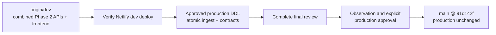

# Handoff Document — TalTech Tunniplaan

**Date**: 2026-08-30
**Branch**: `dev` (combined Phase 2 webapp implementation); `main` is production
**Repo**: https://github.com/siyi-ma/tunniplaan
**Live app / service**: https://taltech-tunniplaan.netlify.app; `dev` branch deploy: https://dev--taltech-tunniplaan.netlify.app

---

## 1. Current Task Objectives

- ✓ Inspect `phase2-api` and `phase2-frontend` against their ancestry, commits, worktree,
  tests, documentation, and remote state.
- ✓ Consolidate both Phase 2 lineages into `dev` and push the combined branch, per the
  owner's final explicit direction.
- ✓ Remove `phase2-api` and `phase2-frontend` from the remote after verifying `dev`.
- ✓ Keep `main` unchanged and exclude the false `unified_courses.json` LFS change.
- ✓ Correct the rollout decision and execution ledger to record the owner's override.
- x Verify the combined `dev` Netlify deployment.
- x Apply production DDL, run the atomic production ingest, and pass both production
  contract gates; this still requires explicit approval and an owner-level credential.
- x Complete Task 10's final independent review and the requested code review against the
  Phase 2 spec/progress ledger. CodeRabbit could not run because its CLI is absent.
- x Promote `dev` to `main` or perform Task 12 cleanup.

---

## 2. Current Progress

### Completed this session

- Established that `phase2-frontend` contains all `phase2-api` commits, so one
  fast-forward carries both stages without duplicate merges.
- Initially published both refs and pushed the API-only stage to `dev` at `773fd4f`.
- After the owner clarified the desired final topology, committed this closeout on the
  frontend lineage, fast-forwarded `dev` to it, pushed `origin/dev`, and removed both
  remote `phase2-*` refs.
- Added `docs/260830-phase2-branch-review-and-rollout.md`, corrected
  `docs/superpowers/sdd/phase2-progress.md`, and wrote this handoff.
- Left `main` at `91d142f`; no production DDL, ingest, or production merge was performed.

### Known working

- The combined branch passes all 5 discovered Node test files with 0 failures.
- Earlier committed evidence records 98 tests with 0 failures, selected JavaScript syntax
  checks passing, a 19/19 local HTTP matrix, a 15/15 browser matrix, and 66,846 timetable
  events deep-equal through the contract gate.
- `unified_courses.json` is not a new dataset edit: its 6,687,128-byte content and SHA-256
  `9ad2679d...` exactly match the committed Git LFS pointer.

---

## 3. Key Context

### Tech stack

| Layer | Technology |
|---|---|
| Frontend | Vanilla JavaScript, HTML, CSS, Tailwind CDN |
| Backend | Netlify Functions, Node.js CommonJS |
| Database | Neon Postgres: `semesters`, `groups`, `courses`, `sessions` |
| Data API | `getDatasetManifest`, paged `getCourses`, versioned `getTimetable` |
| Producer | Python scraper/atomic ingest in separate `tunniplaanScraping` repo |
| Tests | Node test runner, contract scripts, local HTTP and Playwright matrices |

### Architecture / hierarchy



The two temporary webapp feature refs were one linear history and are no longer needed on
the remote. All continuing webapp work starts from `dev`; `main` remains the protected
production boundary.

### Important configuration / gotchas

- `NEON_DATABASE_URL` is the read-only webapp connection. Production ingest uses
  `NEON_SCRAPER_URL` in the scraper repo and remains separately approval-gated.
- Both Phase 2 migrations require an owner-level credential; `scraper_rw` cannot alter
  owner-controlled tables.
- Run locally with `node scripts/dev-functions-server.js`; it is not a Netlify/CDN emulator.
- `git-lfs` is missing in this WSL environment. The hydrated LFS artifact therefore appears
  modified even though it matches its pointer, and LFS hooks fail during pushes.
- The checkout contains CRLF-only noise under default Git settings. Use
  `git -c core.autocrlf=true status --short` for meaningful status.
- Root `prd.md` and `spec.md` do not exist. The authoritative spec is
  `docs/superpowers/specs/260829-neon-phase2-live-dataset.md`.

---

## 4. Key Findings

1. `phase2-frontend` contained every `phase2-api` commit. A single fast-forward into `dev`
   correctly merged both branches without a merge commit.
2. The original recommendation retained the frontend branch until rollout gates passed.
   The owner explicitly overrode that branch topology and requested one remote `dev` branch;
   the override is recorded in `docs/260830-phase2-branch-review-and-rollout.md`.
3. Consolidating code into `dev` does not complete the operational rollout. Deployment,
   production DDL/ingest, contract verification, Task 10 review, and `main` remain open.
4. Task 10's cold-operator findings were applied, but the ledger still requires a final
   independent review (`docs/superpowers/sdd/phase2-progress.md`).
5. `git-lfs` is unavailable. Never stage the apparent `unified_courses.json` modification;
   its exact size/hash matches the committed pointer.
6. README and CLAUDE already describe the combined target architecture and local server, so
   no extra close-session update was needed.
7. The requested CodeRabbit review did not run: its CLI was absent, and the proposed
   `curl | sh` installer was rejected as unsafe. Absence of findings is not approval.

---

## 5. Incomplete Items (priority order)

1. Verify the combined `dev` Netlify branch deployment: page loading, manifest/course pages,
   versioned timetable requests, 409 behavior, and actual CDN cache headers.
2. Obtain explicit owner approval and an owner-level credential, apply both production
   migrations, then run the scraper's atomic production ingest.
3. Run both production contract scripts against the exact ingested source directory and
   retain receipts; stop on any count, hash, or deep-equality mismatch.
4. Complete Task 10's final independent review and the requested code/spec/ledger review.
   Install CodeRabbit only through an auditable source or separately approved installer.
5. Keep `main` unchanged until the `dev` deployment and observation gates earn explicit
   production approval. Do not begin Task 12 before 2026-09-15 and its additional gates.

---

## 6. Suggested Handoff Path

**Files to review first:**

- `docs/superpowers/specs/260829-neon-phase2-live-dataset.md` — authoritative contracts.
- `docs/superpowers/plans/260829-neon-phase2-live-dataset.md` — ordered gates.
- `docs/superpowers/sdd/phase2-progress.md` — live execution ledger.
- `docs/260830-phase2-branch-review-and-rollout.md` — topology review and owner override.
- `course-data.js`, `main.js`, and `netlify/functions/` — combined implementation on `dev`.
- `docs/DATA_REFRESH.md` — webapp-side data refresh runbook.

**Verify first:**

1. Confirm `dev` and `origin/dev` resolve to the same closeout commit and only `main` plus
   normal non-Phase-2 remote refs remain.
2. Run `node --test`; expect 5 discovered files and 0 failures.
3. Inspect the `dev` Netlify deploy before touching Neon production.
4. Confirm migration credentials are owner-capable and ingest credentials are write-scoped.

**Recommended next action:** verify the combined `dev` branch deploy, then stop for explicit
approval before any production DDL or ingest.

---

## 7. Risks and Notes

- **LFS corruption risk** — do not run `git add -A` or stage `unified_courses.json` while
  `git-lfs` is unavailable.
- **Production mutation** — merging code into `dev` does not authorise DDL or ingest.
- **No force operations** — fix forward on `dev`; do not force-push or rewrite remote history.
- **Production boundary** — do not merge `dev` into `main` without explicit approval.
- **Deleted remote refs** — `phase2-api` and `phase2-frontend` are intentionally removed from
  origin after their common history lands on `dev`; the commits remain reachable from `dev`.
- **Already verified** — branch ancestry, exact LFS object identity, and local Node tests do
  not need repeating unless the relevant SHAs or files change.

---

## Suggested First Step for the Next Agent

```bash
git fetch --prune origin
git -c core.autocrlf=true status --short
git rev-parse --short dev origin/dev main origin/main
git branch -r
node --test
```

Expect `dev` and `origin/dev` to match, no `origin/phase2-*` refs, `main` and `origin/main`
at `91d142f`, and only the known `unified_courses.json` artifact in normalized status. Then
verify `https://dev--taltech-tunniplaan.netlify.app`; do not proceed to production DDL or
ingest without explicit owner approval.
