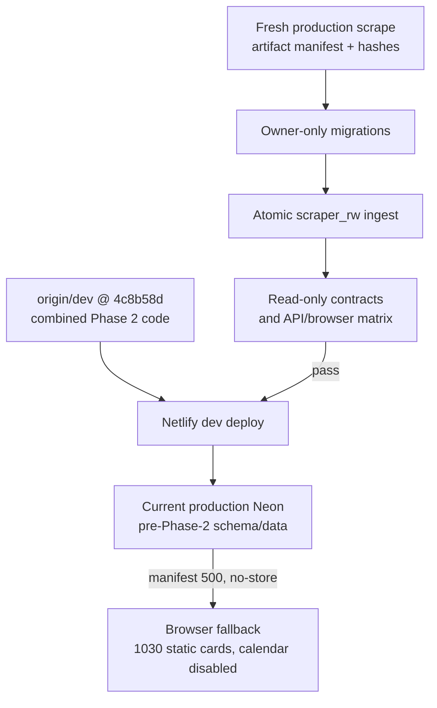

# Handoff Document — TalTech Tunniplaan

**Date**: 2026-08-30
**Branch**: `dev` (combined Phase 2 webapp implementation); `main` is production
**Repo**: https://github.com/siyi-ma/tunniplaan
**Live app / service**: https://taltech-tunniplaan.netlify.app; `dev` branch deploy: https://dev--taltech-tunniplaan.netlify.app

---

## 1. Current Task Objectives

- ✓ Verify that the combined Phase 2 commit `4c8b58d` is deployed on Netlify `dev`.
- ✓ Verify HTTP contracts, cache headers, legacy timetable compatibility, and browser
  fallback behavior without mutating production data.
- ✓ Receive explicit owner approval for the production migrations and atomic ingest.
- ✓ Run all production-safe preflight checks that do not need credentials or valid new
  artifacts.
- x Produce a Phase 2-valid production artifact triple. The current `metadata.json` has no
  `artifacts` block and is rejected before any database connection opens.
- x Supply local production owner, writer, and reader credentials.
- x Apply production DDL, run the atomic ingest, and pass the production contract/browser
  gates. No production database mutation occurred.
- x Complete Task 10's final independent review, merge to `main`, or begin Task 12 cleanup.

---

## 2. Current Progress

### Completed this session

- Confirmed `dev` and `origin/dev` are synchronized at `4c8b58d`; GitHub has only remote
  `dev` and `main`, with the temporary webapp Phase 2 refs removed.
- Confirmed the deployed `course-data.js` and `main.js` hashes exactly match `4c8b58d`.
  Netlify only changes `index.html` by injecting its RUM script; the observed deploy ID was
  `6a945453aeb1200008cca20f`.
- Called the deployed manifest, course, and timetable endpoints directly and recorded status,
  JSON envelope, and `Cache-Control` behavior.
- Ran a real Microsoft Edge smoke test against the branch URL. The fallback network and UI
  checks passed with no unexpected console errors.
- Inspected both repositories' credential availability by key presence only; no secret value
  was printed.
- Ran the scraper's Windows-Python offline gate: 172 tests passed and all four documented
  files passed `py_compile`.
- Ran `neon_ingest.py --dry-run`; it stopped before opening a connection because the current
  source `metadata.json` predates the artifact-manifest contract.

### Known working

- Netlify serves the branch page, `course-data.js`, `main.js`, and the 6,687,128-byte fallback
  artifact with HTTP 200.
- The unversioned compatibility request
  `getTimetable?courses=AAV3351` returns a bare session array with
  `public,max-age=300,stale-while-revalidate=3600`; an empty request returns `[]`.
- Invalid `getCourses` input returns 400 with `no-store`.
- While production Neon lacks Phase 2 data, the browser makes one manifest request (500), no
  course-page requests, and one fallback request (200).
- The deployed fallback renders 1,030 cards, an honest `24.08.2026 17:05` warning in Estonian
  and English, disables calendar view, supports AAV3351 search/reset, and restores
  `?group=IADB11` to 11 cards.
- The webapp worktree has no session-authored code changes. Under
  `core.autocrlf=true`, only the known hydrated `unified_courses.json` LFS artifact appears;
  its SHA-256 exactly matches the committed pointer.

---

## 3. Key Context

### Tech stack

| Layer | Technology |
|---|---|
| Frontend | Vanilla JavaScript, HTML, CSS, Tailwind CDN |
| Backend | Netlify Functions, Node.js CommonJS |
| Database | Neon Postgres (`semesters`, `groups`, `courses`, `sessions`) |
| Producer | Python 3.13 scraper and `neon_ingest.py` in `tunniplaanScraping` |
| Migrations | SQL in `db/migrations/`, executed with table-owner credentials |
| Verification | Node tests/contracts, pytest, direct HTTP checks, Playwright over Edge CDP |

### Architecture / hierarchy



The deployed code is healthy but deliberately in fallback mode because production Neon has
not been migrated or ingested. Code deployment verification and API-data verification are
therefore separate gates.

### Important configuration / gotchas

- Webapp `.env` has `TUNNIPLAAN_DATA_DIR` and `NEON_DATABASE_URL`, but the ledger records that
  read URL as the disposable integration branch, not production.
- Scraper `.env` has `TUNNIPLAAN_DATA_DIR` and both `NEON_TEST_*` URLs. Production
  `NEON_SCRAPER_URL` is empty and production `NEON_DATABASE_URL` is missing.
- No `NEON_ADMIN_URL`, `NEON_OWNER_URL`, or `NEON_MIGRATION_URL` exists locally. The migration
  runner defaults to `NEON_ADMIN_URL` (`scripts/run-sql.js:7-13`).
- The production migrations require the table owner (`neondb_owner`); `scraper_rw` and
  `webapp_ro` cannot run DDL (`db/migrations/20260830_one_active_semester.sql:10-12`).
- WSL Python is not the supported scraper environment: it lacks pytest, cannot resolve the
  Windows OneDrive source path, and cannot write the external repo's `__pycache__`. Use
  `C:\Program Files\Python313\python.exe` through `py.exe -3.13`.
- The scraper is on `phase2-neon-ingest` at `da9f94f`. Its raw status contains many
  line-ending-only modifications; normalized status was clean. Do not stage them.

---

## 4. Key Findings

1. **The deployed code is the intended commit.** `course-data.js` and `main.js` match
   `4c8b58d` byte-for-byte. Netlify's only observed HTML delta is its injected branch-deploy
   RUM tag.
2. **Fallback-mode deployment verification passed.** Edge rendered 1,030 cards, correct dated
   notices in both languages, disabled calendar controls, working search/reset, and an
   11-card `IADB11` deep link with no unexpected console errors.
3. **API-data verification remains blocked.** The deployed manifest returns
   `500 {"error":"manifest_unavailable"}`; valid versioned course and timetable calls also
   return 500. Every failure correctly carries `Cache-Control: no-store`.
4. **Legacy compatibility survives.** Unversioned timetable requests still return production
   sessions with the old five-minute/stale-while-revalidate policy, so the additive backend
   did not break its previous consumer.
5. **The source triple is not ingestible.** The dry-run failed at `verify_artifacts` because
   `metadata.json` has no usable `artifacts` block. This exact first-ingest consequence is
   documented at scraper `docs/superpowers/sdd/phase2-scrape-manifest-report.md:111-119`.
6. **A source decision is required.** The reviewed choices are a normal full scrape or
   `26s_pipeline.py --transform-only`. The full scrape is recommended. Transform-only rewrites
   the old intermediate data and stamps a current `scraping_datetime`
   (`26s_pipeline.py:1141-1171`), which can make old observations look newly scraped.
7. **Approval is not the remaining blocker; credentials are.** Production writer/read URLs
   and an owner-level migration URL are absent locally. No database connection was attempted.
8. **The ledger has known drift.** `docs/superpowers/sdd/phase2-progress.md:73-76` says no
   verified deployment gate has occurred. It should eventually distinguish the completed
   fallback-mode verification from the still-blocked API-mode verification.

---

## 5. Incomplete Items (priority order)

1. Owner chooses and runs the recommended fresh full scrape, producing
   `unified_courses.json`, `sessions.json`, and `metadata.json` with a valid `artifacts` block.
2. Configure credentials locally without posting values in chat:
   `NEON_ADMIN_URL` (`neondb_owner`) in the webapp; production `NEON_SCRAPER_URL`
   (`scraper_rw`) in the scraper; production `NEON_DATABASE_URL` (`webapp_ro`) in both.
3. Re-run `py.exe -3.13 neon_ingest.py --dry-run`; record exact path, mtimes, hash prefixes,
   dataset version, scrape date, course/session counts, failed-group count, and coverage.
4. Apply `20260829_phase2_dataset_version.sql` and
   `20260830_one_active_semester.sql` with `NEON_ADMIN_URL`; verify columns, unique index,
   exactly one active semester, and read-only grants.
5. Run exactly one `py.exe -3.13 neon_ingest.py` production ingest and retain its `INGEST OK`
   plus independent read-only post-commit receipt.
6. Run `contract-test-getcourses.js`, `contract-test-gettimetable.js`, direct Netlify cache
   checks, and the full API-mode browser matrix on the `dev` URL.
7. Update `docs/superpowers/sdd/phase2-progress.md`, complete Task 10's final independent
   review, and obtain separate approval before any `main` merge.

---

## 6. Suggested Handoff Path

**Files to review first:**

- `docs/superpowers/plans/260829-neon-phase2-live-dataset.md` — Task 11 gates and rollback.
- `docs/superpowers/specs/260829-neon-phase2-live-dataset.md` — data/API contracts.
- `docs/superpowers/sdd/phase2-progress.md` — live ledger and credential findings.
- `docs/DATA_REFRESH.md` — webapp-side credential and verification summary.
- `db/migrations/20260829_phase2_dataset_version.sql` and
  `db/migrations/20260830_one_active_semester.sql` — owner-only production DDL.
- `scripts/run-sql.js` — migration runner; defaults to `NEON_ADMIN_URL`.
- Scraper `docs/neon-refresh-runbook.md` — canonical operator sequence.
- Scraper `docs/superpowers/sdd/phase2-scrape-manifest-report.md` — why the current artifacts
  are rejected and the two supported regeneration choices.
- Scraper `neon_ingest.py:528-626` — CLI environment resolution, transaction, independent
  readback, and credential-redacted failure path.

**Verify first:**

1. Confirm the owner selected a fresh scrape and all three production roles are configured by
   environment-variable name; print presence only, never values.
2. Confirm webapp `dev`/`origin/dev` remain `4c8b58d` and scraper
   `phase2-neon-ingest` remains `da9f94f` before generating data.
3. Run the 172-test scraper gate and dry-run again after the new source triple exists.
4. Query production read-only state immediately before DDL/ingest and retain counts/version as
   the rollback baseline.

**Recommended next action:** perform a fresh full production scrape with Windows Python. Do
not apply DDL or ingest until its manifest verifies and all production credentials are
configured locally.

---

## 7. Risks and Notes

- **No production mutation occurred** — approval was received, but preflight stopped before a
  connection because the source manifest and credentials were absent.
- **Do not fabricate a manifest** — only a normal scrape or the reviewed transform-only path
  may produce the first ingest's certified artifact triple.
- **Transform-only freshness risk** — it rewrites data from old intermediates while stamping a
  new scrape time. Prefer the full scrape unless the owner explicitly accepts that tradeoff.
- **Credential separation** — `NEON_ADMIN_URL`, `NEON_SCRAPER_URL`, and
  `NEON_DATABASE_URL` are different authorities. Never substitute the writer for the webapp
  reader or expose any value in output.
- **Production boundary** — this approval covered migrations and one atomic ingest, not a
  `main` merge, production webapp deployment, or Task 12 cleanup.
- **LFS artifact** — do not stage `unified_courses.json` in the webapp while `git-lfs` is
  unavailable; its hydrated bytes match the pointer and are not session work.
- **Cross-repo preservation** — the scraper worktree's raw modified-file list is line-ending
  noise under normalized status. Do not use broad staging commands in either repository.
- **Temporary browser tooling cleaned** — the Edge CDP test script, isolated profile, and
  helper processes were removed after verification.

---

## Suggested First Step for the Next Agent

After the owner confirms the fresh-scrape choice and configures production credentials
locally, run from a Windows-capable shell:

```powershell
cd C:\Projects\tunniplaanScraping
py -3.13 -m pytest tests\ -q
py -3.13 26s_pipeline.py
py -3.13 neon_ingest.py --dry-run
```

Stop after the dry-run and compare its path, mtimes, hashes, version, timestamp, counts,
failed groups, and coverage with the scrape receipt before applying either migration.
