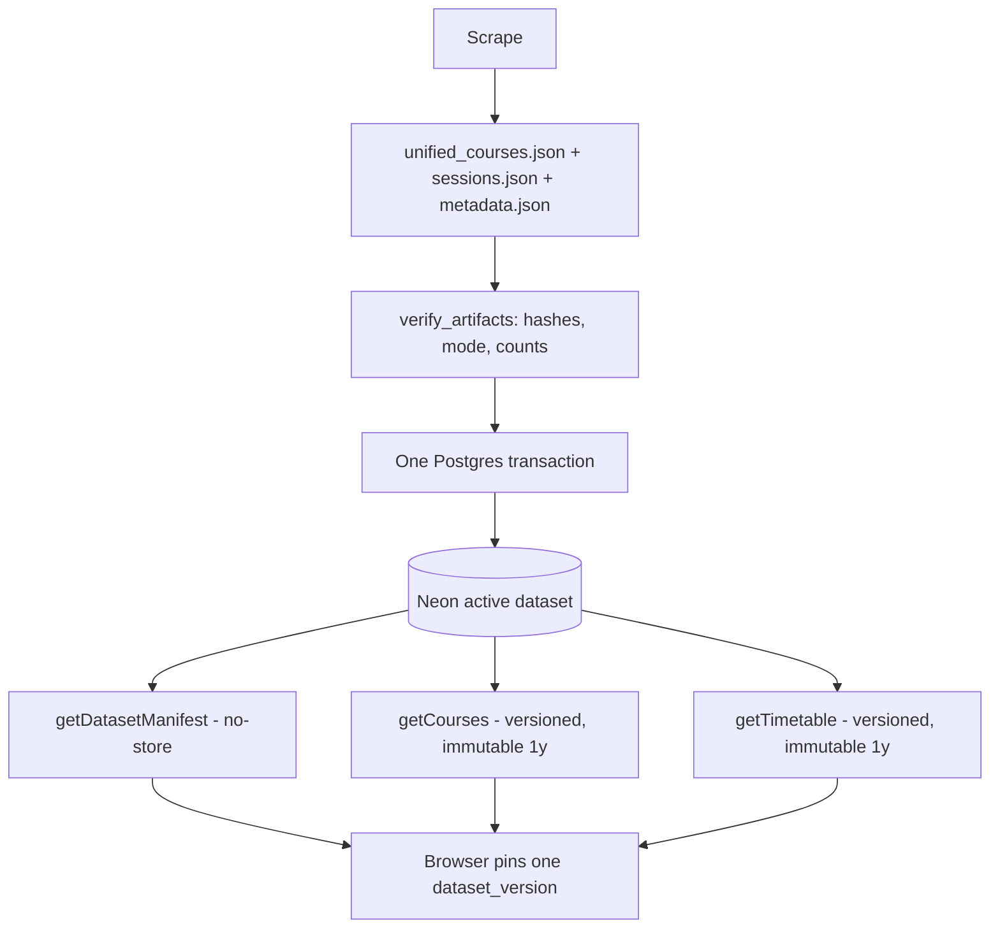

# Handoff Document — TalTech Tunniplaan

**Date**: 2026-08-30
**Branch**: `dev` in both repos (`main` is production; not touched this session)
**Repos**: https://github.com/siyi-ma/tunniplaan · https://github.com/siyi-ma/tunniplaanScraping
**Live app**: https://taltech-tunniplaan.netlify.app

---

## 1. Current Task Objectives

- ✓ Review `docs/superpowers/specs/260829-neon-phase2-live-dataset.md` and
  `docs/superpowers/plans/260829-neon-phase2-live-dataset.md` against the live repositories.
- ✓ Correct factual errors that would stop an implementer, in the document bodies.
- ✓ Record judgement calls as owner decisions rather than applying them unilaterally.
- ✓ Resolve all four open questions with architectural recommendations.
- ✓ Fix the `.gitattributes` LFS defect found during review.
- ✓ Specify the producer-side manifest work in the scraper repo.
- x Begin Phase 2 Task 0. **No implementation started; both drafts remain
  `Draft — pending review` and require owner approval.**
- x No production DDL, ingest, deploy, or merge to `main`.

---

## 2. Current Progress

### Completed this session

**Review pass 1 — five factual blockers (`8e45d0d`)**

| ID | Correction |
|---|---|
| B1 | Scraper repo is `C:\Projects\tunniplaanScraping`; `C:\Projects\scrape_taltech_tunniplaan` does not exist. Also fixed in `CLAUDE.md`. |
| B2 | Ledger moved from the nonexistent `.superpowers/sdd/` to `docs/superpowers/sdd/`, and made committed. |
| B3 | Producer ingest and both contract tests take an explicit source directory. |
| B4 | Drew the Task 3 → Task 6 cross-repo dependency the map omitted. |
| B5 | All `npm test` → `node --test`; `npm`/`npx` blocked by group policy. |

**Review pass 2 — four owner decisions (`8bd1218`, `ad0a205`)**

- Cache: one-year `immutable` on content-addressed URLs; `limit_exceeded` excluded
  (depends on `CALENDAR_SESSION_LIMIT`, not the dataset); `no-store` on every error.
- Reload: user-triggered only, never a timer.
- Fallback: retained until the later of two ingests + 48 h **or 2026-09-15**, and kept
  published during the window.
- Source artifacts: `--source-dir` > `TUNNIPLAAN_DATA_DIR` > configured default.
- New acceptance criteria 6a (pair consistency) and 6b (cache correctness).
- Spec §16 rewritten from open questions into recorded reasoning.

**LFS defect fixed (`9c4e03b`)** — standalone commit, deliberately outside the Phase 2
branches so a Phase 2 rollback cannot revert it.

**Scraper (`2e092d9`, `39c243e`)** — `.env` ignored (it was not, and `NEON_SCRAPER_URL` is
write-capable), `.env.example` added to both repos, and
`docs/260830-scrape-manifest-task.md` written.

### Known working

- `node --test` in the webapp: **7 pass, 0 fail** (Node v22.17.0).
- `python -m pytest tests/ -q` in the scraper: **57 passed, 2 skipped**.
- `git lfs ls-files` returns exactly `unified_courses.json`.
- No application code changed this session. Only docs, `.gitattributes`, `.gitignore`,
  `.env.example`, `README.md`, `CLAUDE.md`.

---

## 3. Key Context

### Tech stack

| Layer | Technology |
|---|---|
| Frontend | Vanilla JS, HTML, CSS, Tailwind CDN |
| Backend | Netlify Functions, Node CommonJS, `@neondatabase/serverless` 1.1.0 |
| Database | Neon Postgres — `semesters`, `groups`, `courses`, `sessions` |
| Producer | Python/Selenium, `C:\Projects\tunniplaanScraping` |
| Tests | `node --test` (webapp), pytest (scraper) |

### Environment constraints — read before running anything

- **`npm` and `npx` are blocked by group policy.** Use `node --test`, `node --check`,
  `node scripts/<name>.js`. Never make a gate depend on `npm run` or `npx`.
- `@neondatabase/serverless` was missing from `node_modules` and cannot be installed here.
  It was vendored from `C:\Projects\sar-reader` (exactly 1.1.0, zero dependencies — the other
  three sibling projects carry 0.10.4, the wrong major). `node_modules/` is gitignored, so
  this is per-device and will need repeating on another machine.
- `.env` exists in neither repo. Copy from `.env.example`.
- The source artifacts live in the scraper's `DATA_DIRECTORY` (a OneDrive path), **not** in
  the webapp worktree. `sessions.json` was deleted from the webapp in Phase 1 and is
  gitignored.

### Architecture (Phase 2 target)



---

## 4. Key Findings

1. **`package.json` was an LFS pointer in `HEAD`.** `.gitattributes` globbed `*.json`, so
   `git show HEAD:package.json` returned `version https://git-lfs.github.com/spec/v1`. A
   clone without `git lfs pull` had no readable manifest. Fixed in `9c4e03b`; the
   `CLAUDE.md` line that recommended the glob is corrected too.
2. **The dataset version does not prove the source pair is self-consistent.**
   `sessions.json` is a flat array with no `scraping_datetime`
   (`tunniplaanScraping/docs/data-contract.md:85-97`), so a fresh `unified_courses.json`
   paired with a stale `sessions.json` yields a well-formed new version for an inconsistent
   dataset — and version coherence would then guarantee every user sees the same wrong data.
   Closed by spec §7.2.1.
3. **No new sidecar is needed for that.** `26s_pipeline.py:1139-1165` already writes
   `metadata.json` beside both artifacts with `scraping_datetime`, a `TEST`/`PRODUCTION`
   mode, and per-run statistics, and `resolve_output_filenames()` already applies the
   `_test` suffix to it. It only lacks hashes.
4. **The spec's measurements are exact.** Re-measured: 6,687,128 raw bytes; 5,168,251
   compact; largest 200-course page 1,100,773 B (1.050 MiB). The `courses` table covers all
   25 source course fields with no gap.
5. **Reload is not lossless.** `main.js` round-trips `group`, `search`, `searchField`,
   `faculty`, `institutecode` — but not EAP, teaching language, or calendar-view state.
   Spec §10.3 previously claimed otherwise.
6. **`getTimetable` caches the active semester code for 5 minutes**
   (`netlify/functions/getTimetable.js:20-33`). A versioned request must not be served from
   that warm-lambda cache; plan Task 8 owns this.
7. **`db/roles.sql:10` grants `webapp_ro` SELECT on all four tables** — but whether it was
   ever applied to production is unverified. Task 0 must query
   `information_schema.role_table_grants`.

---

## 5. Incomplete Items (priority order)

1. **Owner approval to begin Task 0.** Both drafts are `Draft — pending review` with zero
   open questions. Nothing else can start.
2. **Scraper `docs/260830-scrape-manifest-task.md`** — must land before the first production
   ingest. It is on Phase 2's critical path (plan Task 2 depends on it).
3. Phase 2 Tasks 0–12, in the plan's order, with the per-task independent review loop.
4. Decide Task 9's local function server implementation (specified, not written).
5. `main` is behind `dev` by 5 commits (webapp) and 2 (scraper). No promotion this session.

---

## 6. Suggested Handoff Path

**Files to review first:**

- `docs/superpowers/specs/260829-neon-phase2-live-dataset.md` — authoritative contracts.
  Read §7.2.1, §7.2.2, §9.2, §9.3, §10.3, §14, §16 first; those changed today.
- `docs/superpowers/plans/260829-neon-phase2-live-dataset.md` — execution order. §1.1
  (ledger), §3 (dependency map), Task 0, Task 9 changed today.
- Both files' **Amendment log** and **Review notes** sections carry the verdict and rationale
  for every change, and record what was deliberately *not* applied.
- `C:\Projects\tunniplaanScraping\docs\260830-scrape-manifest-task.md`.

**Verify first:**

```bash
cd C:/Projects/tunniplaan && node --test          # expect 7 pass, 0 fail
git lfs ls-files                                   # expect exactly unified_courses.json
git show HEAD:package.json | head -c 20            # expect '{', not an LFS pointer
cd C:/Projects/tunniplaanScraping && python -m pytest tests/ -q   # expect 57 passed
```

If `node --test` reports `Cannot find module '@neondatabase/serverless'`, this is a fresh
device: copy `node_modules/@neondatabase/serverless` from `C:\Projects\sar-reader` (verify
its `package.json` says 1.1.0 first). Do not attempt `npm install`.

**Recommended next action:** ask the owner to approve the drafts. On approval, start Task 0
— and note that Task 0 is now larger than the original draft: it resolves the source
directory, checks OneDrive hydration, copies `.env`, and records role grants.

---

## 7. Risks and Notes

- **Draft status is load-bearing.** The plan forbids implementation before review approval.
  This is why the Task 9 function server was specified but not written.
- **Cross-repo ordering.** The scraper manifest task must land before webapp Task 2's
  consistency helper, and Task 3 before Task 6. Neither is optional.
- **Vendored dependency is per-device.** `node_modules/` is gitignored; another machine will
  hit the same module-not-found failure.
- **Write credential.** `NEON_SCRAPER_URL` belongs only in the scraper's `.env`, now
  gitignored. Before today it was not.
- **`metadata.json` becomes a cross-repo contract** once the ingest consumes it. The
  data-contract rule "a change to any consumed field is breaking" starts applying to it.
- **Fallback removal is date-gated at 2026-09-15**, not "when it feels safe".
- **No production surface changed.** Docs, git config, and dotfiles only.

---

## Suggested First Step for the Next Agent

```text
Read the Amendment log and Review notes in
docs/superpowers/specs/260829-neon-phase2-live-dataset.md and its plan counterpart before
anything else. They record what two review passes changed, why, and what was deliberately
left to the owner. Then confirm the owner has approved the drafts -- both still say
"Draft -- pending review", and the plan forbids implementation until that changes.

Do not run npm. Use `node --test`.
```
