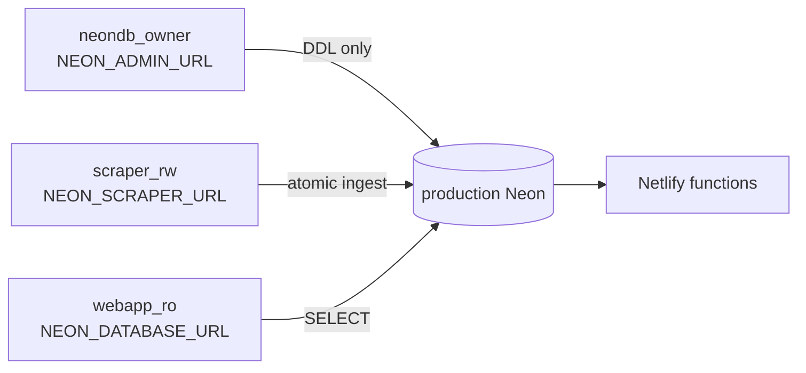

# Handoff Document — TalTech Tunniplaan

**Date**: 2026-08-31
**Branch**: webapp `dev`; scraper `phase2-neon-ingest`
**Repos**: https://github.com/siyi-ma/tunniplaan · https://github.com/siyi-ma/tunniplaanScraping
**Live**: https://taltech-tunniplaan.netlify.app · dev: https://dev--taltech-tunniplaan.netlify.app

---

## 1. Current Task Objectives

- ✓ Review the Phase 2 branch state and recommend the next action.
- ✓ Correct the execution ledger's claim that no deployment gate had passed.
- ✓ Make `scripts/run-sql.js` read `.env` like every other script in the repo.
- ✓ Configure the three production Neon credentials and apply both production migrations.
- ✓ Verify the migrations read-only and prove them idempotent in production.
- ✓ Unblock the production scrape (an AppLocker publisher policy, not a missing driver).
- ✓ Diagnose the daily-view tab timeout that lost 22 of 269 groups.
- ✓ Complete a full production scrape. 429 groups, 133 minutes, 0 failed groups.
- ✓ Run the atomic production ingest and both contract gates.
- x API-mode browser matrix against the `dev` URL.
- x Refresh the committed `unified_courses.json` rollback artifact (this is a deploy).
- x Task 10 final independent review; merge to `main`; Task 12 cleanup.

---

## 2. Current Progress

### Completed this session

- **Production DDL applied.** `20260829_phase2_dataset_version.sql` and
  `20260830_one_active_semester.sql` ran with `NEON_ADMIN_URL` (`neondb_owner`), after a
  read-only baseline, and were re-applied once to prove idempotence in production.
- **Verified as `webapp_ro`**: both columns present and nullable, `semesters_one_active`
  built, exactly one active semester, SELECT granted and UPDATE denied on the new columns
  (F10 held — table grants extend to columns added later), 66,846 sessions untouched.
- **Credentials configured** by the owner in both `.env` files: `neondb_owner`,
  `scraper_rw`, `webapp_ro`, all on `ep-lively-cherry-as4w8a51-pooler`.
- **`scripts/run-sql.js` now loads `.env`** through the same helper as
  `contract-test-getcourses.js` and `dev-functions-server.js`.
- **Scrape unblocked.** The pipeline resolves `TUNNIPLAAN_DATA_DIR` and drives Edge through
  an explicit Microsoft-signed `msedgedriver.exe`.
- **Baseline snapshot** of the 24.08 dataset taken before any scrape could overwrite it.

### The scrape and ingest (2026-08-31)

- Full scrape: 429 groups, 133 minutes, **0 failed groups**. 27 failed the main pass; the
  pipeline's own retry (`26s_pipeline.py:1057`) recovered 23, then the last 4.
- Baseline comparison before ingesting: +48 sessions, +1 course. Five group codes vanished,
  all explained: four are the source-side location-suffix strip
  (`EAKB50_Kuressaare`→`EAKB50_K`, `SDSR30A/50A/70A`→`SDSR30/50/70`) with sessions intact;
  `TVTB12` was delisted by TalTech and is absent from the live structure tree.
- One atomic ingest, 4.3s, `INGEST OK` with an independent post-commit re-read.
- Production now: `dataset_version` `3aaa3367…f2fc0ad`, `ingested_at` 2026-08-31T08:48:34Z,
  `scraping_datetime` `31.08.2026 11:45`, 1,031 courses / 429 groups / 66,894 sessions.
- Live `dev`: manifest **200** `no-store`; `getCourses` page 0 200
  `public,max-age=31536000,immutable`; versioned `getTimetable` 200; both contract tests pass
  with all 66,894 events deep-equal.

### Known working

- Production Neon carries the Phase 2 schema and the 31.08 dataset.
- The deployed `dev` manifest returns **200** with `Cache-Control: no-store`; the
  unversioned `getTimetable` still returns 200 for its legacy consumer.
- The site loads through the API. The committed `unified_courses.json` remains the fallback
  and is now a week stale — see Incomplete Item 2.
- Headless Edge drives the live timetable site from this device.
- 172 scraper tests pass; 98 webapp tests pass (`node --test` from the repo root — passing
  `tests/` as an argument fails with MODULE_NOT_FOUND).

---

## 3. Key Context

### Tech stack

| Layer | Technology |
|---|---|
| Frontend | Vanilla JS, Tailwind CDN |
| Backend | Netlify Functions, Node CommonJS, `@neondatabase/serverless` |
| Database | Neon Postgres `tunniplaan-aws`, branch `main`, PG 17 |
| Producer | Python 3.13, Selenium over Edge, `neon_ingest.py` |
| Verification | `node --test`, pytest, direct HTTP, read-only SQL |

### The three Neon roles



Netlify stores **only** `NEON_DATABASE_URL`. An owner credential was briefly added to the
Netlify environment this session and removed — never put a write or owner credential there;
every function process would receive it in its environment.

### Gotchas

- `26s_pipeline.py` has no resume and writes intermediates only at the end. A killed run
  loses everything. Run it from the operator's own shell, never from an agent's background
  task — a 2.5-hour run outlives the harness that started it.
- Selenium Manager cannot run on this device (see Key Findings 1). `drivers/` is gitignored.
- The webapp `.env` `NEON_DATABASE_URL` now points at **production**, so
  `scripts/contract-test-*.js` and `dev-functions-server.js` are no longer sandboxed. The
  disposable branch survives as `NEON_TEST_DATABASE_URL` in the scraper `.env`.
- `NEON_SCRAPER_URL` is present in the webapp `.env` but unused there; nothing in this repo
  writes to Neon. Safe to delete.

---

## 4. Key Findings

1. **The scrape was never blocked by a missing driver.** Selenium's documentation is explicit
   that a driver binary is still required and that Selenium Manager only automates fetching
   it. The effective AppLocker policy on this device allows executables **by publisher**:
   `Allow | Everyone | O=MICROSOFT CORPORATION` plus `Allow | Everyone | %PROGRAMFILES%\*`.
   `selenium-manager.exe` is not Microsoft-signed, so it never launches; `msedgedriver.exe`
   is, so it runs from any ordinary directory with no admin rights.
   `resolve_edge_service()` in `26s_pipeline.py` now prefers it.
2. **The daily-view failures are bursts, not broken groups.** 22 of 269 groups failed in 11
   adjacent clusters with 125 consecutive successes between them. Failure screenshots show
   fully populated timetables, and 6 of 6 retested groups scraped normally later. Successful
   groups take a uniform 13s (max 17s over 246), so a failure is a total absence of the tab,
   not a slow response — raising the timeout would change nothing. Both back-to-back attempts
   land in the same bad window. **The pipeline already handled this** at
   `26s_pipeline.py:1057` — up to two further passes over the failed set — which the
   2026-08-30 run never reached because it was killed at group 269. A redundant second pass
   was added in `d53254e` and reverted in `5cf9f5f`. The 2026-08-31 run confirmed the
   built-in retry: 27 failed, 23 recovered on pass 1, the last 4 on pass 2.
3. **`CONSECUTIVE_FAIL_LIMIT` is 12** (`26s_pipeline.py:86`) and the largest observed cluster
   was 4. A longer burst would abort a 2.5-hour scrape outright. Left unchanged on one run's
   evidence; watch it.
4. **The pipeline's error handler crashed on its own output.** It printed an emoji, and with
   stdout redirected the console codepage is cp1257, so the handler died with
   `UnicodeEncodeError` and buried the policy block it existed to report. Fixed in `532c278`.
5. **`26s_pipeline.py` hardcoded a data directory** with a username that exists on one
   machine (ledger F2, never actually fixed in the pipeline). Fixed in `532a9f1`.
6. **`run-sql.js` did not read `.env`** while the docs had called `.env` the local source of
   truth for `NEON_ADMIN_URL` since Phase 1 — on the one script that applies production DDL.
7. **The 24.08 artifacts were themselves `transformation_only`** with
   `bak_mag_groups_scraped: 0`, so that run's `failed_groups: 0` is not a baseline for a
   healthy full scrape. There is no known-good failure count to compare against.
8. **`node --test tests/` fails** with MODULE_NOT_FOUND; `node --test` from the repo root
   discovers all 98 correctly.

---

## 5. Incomplete Items (priority order)

1. Run the API-mode browser matrix against the `dev` URL. The site now loads through the
   API rather than the fallback, and that path has never been exercised in a real browser
   against production data.
2. Refresh the committed `unified_courses.json` rollback artifact with
   `python publish_to_webapp.py`. It is still the 24.08 copy, so a fallback today would
   serve a week-old timetable. **Committing it is a deploy** (CLAUDE.md), so it needs its
   own decision, not a fold-in.
3. Complete Task 10's final independent review and obtain separate approval before any
   `main` merge.
4. Task 12 cleanup: remove the committed `unified_courses.json` at the end of the
   observation window (not before 2026-09-15).

---

## 6. Suggested Handoff Path

**Files to review first:**

- `docs/superpowers/sdd/phase2-progress.md` — the ledger; F16/F17 opened, F1/F2/F12 closed.
- `docs/superpowers/plans/260829-neon-phase2-live-dataset.md` — Task 11 gates and rollback.
- Scraper `26s_pipeline.py` — `resolve_edge_service()` and `create_edge_driver()`.
- Scraper `26s_pipeline.py` — `scrape_timetable_for_groups()`, second pass at the end.
- Scraper `docs/neon-refresh-runbook.md` — canonical operator sequence.

**Verify first:**

1. Both worktrees clean and at the SHAs in this document's header.
2. `msedgedriver.exe --version` matches the installed Edge (152.0.4191.53 as of 2026-08-31);
   after an Edge update, re-download from
   `https://msedgedriver.microsoft.com/<version>/edgedriver_win64.zip`.
3. Production still reads: 1 active semester, `dataset_version` NULL, 66,846 sessions.

**Recommended next action:** run the scrape from a shell the agent does not own, then bring
its `metadata.json` artifact block and group counts back before touching the ingest.

---

## 7. Risks and Notes

- **Never run the scrape from an agent background task.** The 2026-08-30 attempt reached
  group 269/429 over 75 minutes and was killed by the harness, losing all of it.
- **A failed group silently contributes zero sessions.** The contract tests compare source
  against database, not new against old, so they will not catch a dataset that is internally
  consistent but missing 30 groups. The count comparison in Incomplete Item 2 is the only
  gate that would.
- **The ingest is atomic; the scrape is not.** A partial scrape that finishes produces a
  complete-looking artifact triple. Check `failed_groups` in `metadata.json` before ingesting.
- **Credential separation** — `NEON_ADMIN_URL`, `NEON_SCRAPER_URL` and `NEON_DATABASE_URL`
  are three different authorities. Never place a write or owner credential in Netlify.
- **Local contract tests now hit production.** They are read-only, but no longer sandboxed.
- **`drivers/msedgedriver.exe` is machine-local and gitignored.** A fresh clone on another
  machine needs its own copy or `EDGEDRIVER_PATH`.
- **Production data is unchanged.** No ingest ran; Neon holds the 24.08 dataset and the
  committed LFS `unified_courses.json` remains the rollback artifact.

---

## Suggested First Step for the Next Agent

Confirm the operator has run the scrape and that it completed, then:

```powershell
cd C:\Projects\tunniplaanScraping
py -3.13 neon_ingest.py --dry-run
```

Stop after the dry-run. Compare `total_courses`, `total_sessions`, `total_groups` and
`failed_groups` in `metadata.json` against 1,030 / 66,846 / 430 / 0 before applying anything.
