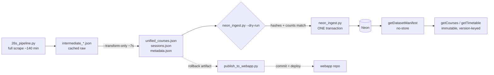

# Handoff — session_status root-cause fix, re-ingest, and capability exploration

**Date**: 2026-08-31
**Repos**: webapp `C:\Projects\tunniplaan` (`dev`) + scraper `C:\Projects\tunniplaanScraping` (`dev`)
**Supersedes**: `C:\Projects\tunniplaanScraping\docs\260831-handoff-ingest-readiness-repo-rename.md`

> That predecessor handoff is now **historically accurate but operationally stale**. Its §5
> items are all closed, and its `py -3.13` guidance is wrong (see finding 6).

---

## 1. Current Task Objectives

| | Objective |
|---|---|
| ✓ | Continue the Neon ingest per the predecessor handoff |
| ✓ | Promote the webapp `dev` → `main` so production serves the Phase 2 API |
| ✓ | Fix the null `session_status` values (predecessor finding 5) |
| ✓ | Refresh the stale rollback artifact in the webapp repo |
| ✓ | Fast-forward the scraper's `phase2-neon-ingest` into `dev` |
| ✓ | Explore targeted scraping by school / institute / group |
| ✓ | Explore scheduled scraping Mon–Fri 23:00 until 2026-09-14 |
| ✗ | **Implement** either explored capability — not authorised; user asked only to explore |
| ✗ | Update the scraper's `CLAUDE.md` Session Status / Week Representation sections (see §5.1) |

---

## 2. Current Progress

### Completed this session

1. **The ingest was already done.** Before running anything destructive, read live Neon via
   `webapp_ro`: `dataset_version` `3aaa3367…0f2fc0ad`, 1031 courses / 429 groups / 66894
   sessions, `scraping_datetime` `31.08.2026 11:45` — matching the artifacts exactly.
   Webapp commit `8232967` recorded it. **Re-running would have deleted and rebuilt 66894
   rows to reach the identical state.** The predecessor handoff was written by a session
   unaware the webapp-side session had already ingested.
2. **Promoted webapp `main` to `8232967`.** Production had only `getTimetable.js`, so
   `getDatasetManifest` returned 404 and the site was running on the committed fallback.
   Manifest went 404 → 200 in ~10s after the push.
3. **Root-caused and fixed the null `session_status`** — scraper commit `a079717`.
4. **Re-derived and re-ingested** the corrected dataset: version `67fb6c95…74bbd8b8`.
5. **Refreshed the rollback artifact** — webapp commit `e28c72b`, pushed to `dev` and `main`.
6. **Fast-forwarded scraper `dev`** `30a0ad8..a079717`; `dev == phase2-neon-ingest`.
7. **Researched both exploration questions** (findings 7–9). No code written for either.

### Known working

- Production manifest serves `67fb6c9563cc8250 | scraped: 31.08.2026 13:50`, HTTP 200.
- `node scripts/contract-test-getcourses.js` → `COURSE CONTRACT OK … courses=1031 groups=429 pages=6`
- `node scripts/contract-test-gettimetable.js` → `CONTRACT OK: all responses deep-equal`
- Scraper suite: **173 passed / 13 skipped**. Webapp suite: **98/98**.
- Production `unified_courses.json` fallback `Content-Length: 6721067`, byte-matching local.

---

## 3. Key Context

| | |
|---|---|
| Scraper pipeline | `26s_pipeline.py` |
| Ingest | `neon_ingest.py` + `data_contract.py` |
| Runbook | scraper `docs/neon-refresh-runbook.md` (accurate; both branch rows now say `dev`) |
| Data dir | `TUNNIPLAAN_DATA_DIR` → `…\OneDrive - Tallinna Tehnikaülikool\M_õppetöö\TunniplaaniAI\26s\data` |
| **Python** | plain `python` (3.14). **NOT `py -3.13`** — see finding 6 |
| Neon project | `billowing-haze-50098055` (`aws-eu-central-1`) |
| Active dataset | `67fb6c9563cc8250216c44b584ea75ce8244a5249f3e61d93b387ac874bbd8b8` |



### Gotchas

- **`--transform-only` re-derives everything from cached intermediates in ~7s with no
  re-scrape.** This is the correct tool for any bug in `create_final_unified_courses()`.
  It leaves `bak_mag_groups_scraped: 0` in `metadata.json`; that is expected, not a failure.
- OneDrive `LastWriteTime` is unreliable (Files On-Demand placeholders). Use content hashes.
- The ingest's first statements are `DELETE FROM sessions/courses/groups` for the semester
  (`neon_ingest.py:415-417`). Safe against failure, not against bad-but-valid data.
- **Never paste a connection string into a log, a commit, or a report.**

---

## 4. Key Findings

1. **The `session_status` bug was 3× larger than the predecessor handoff reported.**
   Re-deriving moved **216 of 3304 group_sessions (~6.5%)**, not 69 (~2%):

   | Transition | Count | Visible effect |
   |---|---|---|
   | `None → online` | 60 | none — webapp already rendered null as online |
   | `None → offline` | 9 | in-person courses were shown as online |
   | **`offline → hybrid`** | **147** | **silent: online half of the teaching was lost entirely** |

   Distribution before `{'offline': 3097, 'hybrid': 123, 'online': 15, None: 69}`;
   after `{'offline': 2959, 'hybrid': 270, 'online': 75}`.

2. **Root cause, `26s_pipeline.py`.** The inline parser split `oppenadalad` on `,` and kept
   only `.isdigit()` parts, so every *range* ("1-16", "1-7, 9-15") collapsed to no weeks —
   219 of 66894 sessions. Status was then derived from those week sets, so a group whose
   weeks would not parse could not report how it is taught.

3. **The fix separates two independent facts.** `parse_week_numbers()` (new, tested) handles
   comma lists, ranges, mixed forms, and the `-1` sentinel. A new `modes` accumulator records
   delivery mode straight from `is_veebiope`, independent of weeks. **`session_status is None`
   now means only "this group has no sessions at all."**

4. **`sessions.json` was byte-identical after the fix** (sha256 `328fad27755c…` unchanged).
   This is the proof that only the course-level aggregation was wrong and the raw scrape was
   always correct — which is why no re-scrape was needed.

5. **Production was a release behind in two independent ways**: `main` lacked the Phase 2
   functions (manifest 404), *and* the committed fallback was the 2026-08-24 dataset. The
   site worked because `course-data.js` silently falls back. **A working site is not evidence
   that the API path works** — check the manifest directly.

6. **`py -3.13` cannot run the pipeline.** It lacks selenium
   (`ModuleNotFoundError: No module named 'selenium'`). Plain `python` (3.14) has the complete
   environment: selenium 4.40.0, psycopg 3.3.2, pytest 9.1.1, bs4, requests. The runbook's
   plain `python` commands are correct; only the predecessor handoff says otherwise.

7. **Targeted scraping — feasible for group and school, NOT for institute.**
   The scrape iterates *groups* from `tpg_map` (`26s_pipeline.py:1056`), a group→faculty map
   built from the faculty structure tree.

   | Target | Feasible | Why |
   |---|---|---|
   | Group | yes | it *is* the unit of iteration (429 groups) |
   | School / faculty | yes | `tpg_map` values; 7 distinct |
   | Programme | small change | in the tree, not carried into `tpg_map` |
   | **Institute** | **no** | `institute_code` is parsed in `transform_course()` from the course-detail field *"Ainet õpetavad struktuuriüksused"* — a **course** property discovered only after scraping, absent from the group tree |

   Faculty sizes: INSENERITEADUSKOND 172, INFOTEHNOLOOGIA 86, MAJANDUS 72, LOODUS 46,
   VIRUMAA KOLLEDŽ 24, MEREAKADEEMIA 22, KURESSAARE KOLLEDŽ 7. Amortised ~19 s/group
   (7986s / 429).

8. **`tpg` is the only safe merge key for a partial scrape.** Present on all 66894 raw rows,
   430 distinct, a total lossless partition by unit of work. `ryhmad` must **not** be used:
   77% of rows list more than one group, and `IADB50A` appears in 126 rows but was scraped
   under only 63 of them. The ingest is whole-semester `DELETE`+`COPY`, so a partial artifact
   would wipe the other 428 groups — atomically. **Do not make the ingest partial.**

   ```mermaid
   flowchart LR
       T[targeted scrape<br/>N groups] --> M[merge into cached<br/>intermediate_timetable_data.json<br/>keyed on tpg]
       M --> X[full --transform-only<br/>~7s]
       X --> N[normal atomic full ingest<br/>UNCHANGED]
   ```

9. **Scheduled scraping is feasible but gated on the non-headless requirement.**
   Headless silently fails the daily view for some groups (e.g. VDXR) and can abort a run, so
   Task Scheduler **must** use *"Run only when user is logged on"* — session 0 has no
   interactive desktop. A **locked** workstation is fine; a logged-off one is not. Mon–Fri
   from 2026-08-31 to 2026-09-14 inclusive = **11 runs**; a 23:00 start finishes ~01:20,
   so the machine needs "Wake the computer to run this task" *plus* a power plan that will
   not sleep mid-run. Per run: ~53 MB `sessions.json` + 6.7 MB `unified_courses.json`
   rewritten inside a OneDrive-synced folder.

---

## 5. Incomplete Items (priority order)

### 5.1 Scraper `CLAUDE.md` is stale and will cause the bug to be reintroduced

`CLAUDE.md:308-313` "Session Status Classification" states the status is *"Based on
`is_veebiope` flag aggregated **across all weeks**"* — that is a description of the removed
logic. `CLAUDE.md:315-320` "Week Representation" documents only the comma-list input shape,
omitting ranges and the `-1` sentinel. **Highest priority**: an agent following the current
text would rebuild the defect.

### 5.2 Decide whether to build either explored capability

Neither is authorised. See findings 7–9. Recommended order if both are wanted: schedule
first (the add/drop window is open now), targeting second as an optimisation.

### 5.3 A targeted scrape can never detect a deletion

If TalTech delists a group or course, cached intermediate rows persist indefinitely. Any
targeted mode needs (a) periodic full-scrape reconciliation and (b) provenance in
`metadata.json` recording which groups are fresh vs inherited.

### 5.4 A scheduled job needs a fail-safe wrapper

Must gate the ingest on `metadata.json` `mode == "PRODUCTION"` **and** `failed_groups == 0`,
then run both contract tests, then write a status line a human can check in the morning.
Must never pass `--pause-on-error` (it blocks forever unattended). Do **not** put
`publish_to_webapp.py` in the nightly job — that commits, and committing is a production
deploy.

### 5.5 Scraper `dev` is 18 commits ahead of `main`

Fast-forwardable (`git rev-list --left-right --count main...dev` → `0  18`). Not promoted
this session; the scraper's `main` has no deployment role.

### 5.6 Rollback artifact removal (webapp Task 12)

The committed `unified_courses.json` is a recovery artifact for the observation window only.
Refreshing it is a manual production deploy. Removal is still pending.

---

## 6. Suggested Handoff Path

**Files to review**, in order:

1. `C:\Projects\tunniplaanScraping\26s_pipeline.py` — `parse_week_numbers()` (immediately
   before `create_final_unified_courses`) and the `modes` accumulator in the group loop
2. `C:\Projects\tunniplaanScraping\tests\test_transformations.py` — the 14 new tests
3. `C:\Projects\tunniplaanScraping\docs\neon-refresh-runbook.md` — the canonical procedure
4. `C:\Projects\tunniplaan\netlify\functions\getDatasetManifest.js` — the `no-store` anchor
   that invalidates every immutable URL behind it

**Verify steps:**

```bash
cd /c/Projects/tunniplaanScraping && python -m pytest tests/ -q
cd /c/Projects/tunniplaan && node --test
```

**Recommended next action**: fix §5.1, then ask the user which of §5.2's two capabilities
to build.

---

## 7. Risks and Notes

- **A green site proves nothing about the API.** `course-data.js` falls back to the committed
  `unified_courses.json` when the API is unavailable, silently. Always check the manifest
  endpoint directly, not the rendered page (finding 5).
- **Never re-ingest to "make sure".** Read `dataset_version` from Neon and compare it to
  `metadata.json` first. The ingest deletes 66894 rows before reloading them.
- **`--transform-only` is the right tool for aggregation bugs**, and 1200× faster than a
  re-scrape. Reach for a full scrape only when the raw data itself is suspect.
- **Do not make the ingest partial** to support targeted scraping. Merge at the intermediate
  layer instead (finding 8). A partial artifact through the current ingest is an atomic,
  consistent, total data loss.
- **`session_status is None` is now meaningful.** It means "no sessions at all", not "unknown".
  If nulls reappear after this fix, the cause is different and worth investigating.
- **Credential hygiene**: `netlify env:list --json` prints plaintext connection strings.
  Filter by key name only. Build-hook URLs are secrets too.
- **Scraper `main` is 18 behind `dev`** and has no deployment role — do not assume it is current.

---

## 8. Suggested First Step for the Next Agent

```bash
# 1. Confirm the live dataset still matches the artifacts before touching anything
node -e "fetch(process.argv[1]).then(r=>r.json()).then(m=>console.log(m.dataset_version,m.scraping_datetime))" \
  "https://taltech-tunniplaan.netlify.app/.netlify/functions/getDatasetManifest"
# expect 67fb6c9563cc8250… | 31.08.2026 13:50

# 2. Then fix the stale scraper CLAUDE.md sections (§5.1)
sed -n '306,322p' /c/Projects/tunniplaanScraping/CLAUDE.md
```
