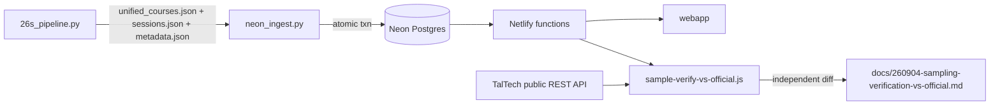

# Handoff — 260904 daily-view scrape fix

Branches: `dev` in both `C:\Projects\tunniplaan` (webapp) and
`C:\Projects\tunniplaanScraping` (scraper). Neither promoted to `main`.

## 1. Current Task Objectives

Directive: scrape today's tunniplaan, ingest to Neon, random-sample the webapp
against `https://tunniplaan.taltech.ee/#/public`, log the results.

- [x] Full production scrape (428/428 groups, 0 failures)
- [x] Atomic Neon ingest, post-commit verified
- [x] Both API contract tests green
- [x] Sampling verification vs. the official REST API, logged
- [x] Docs updated (2 CLAUDE.md, 2 README.md)
- [ ] Nothing promoted to `main` in either repo

## 2. Current Progress

### Completed 2026-09-04

The live dataset is
**`e400f2a588cccc41284a5b76dddcbc51da4b30c9b6c59a668c7b0e3587cc0755`** —
1026 courses, 428 groups, 67257 sessions, scraped 04.09.2026 22:19.

It **replaced a defective dataset**
(`9eedf89ff5f1dd0432f8b274cfc3d2771d754faff8f83ddc54c8d653c1a93232`, ingested
2026-09-04 21:20, 63337 sessions) in which 26 of 428 groups had been parsed from
the site's weekly table and were missing 40-95% of their sessions. That dataset
passed both contract tests and exited 0.

### Known working

- `python -m pytest tests/ -q` in the scraper repo: 190 passed, 13 skipped.
- `node scripts/contract-test-getcourses.js` and `contract-test-gettimetable.js`:
  both OK against the live dataset; all 67257 sessions deep-equal.
- `node scripts/sample-verify-vs-official.js`: three passes, 10600/10600 sessions
  matched, 0 missing, 0 extra.

## 3. Key Context

| Component | Detail |
|---|---|
| Scraper | `C:\Projects\tunniplaanScraping\26s_pipeline.py`, Selenium Edge + BeautifulSoup |
| Ingest | `neon_ingest.py`, atomic single transaction, `NEON_SCRAPER_URL` writes / `NEON_DATABASE_URL` re-reads |
| Webapp | `C:\Projects\tunniplaan`, Netlify functions over Neon Postgres |
| Oracle | `https://tunniplaan-api.taltech.ee/`, `POST api/public/search` |
| Verifier | `scripts/sample-verify-vs-official.js` (new this session) |

A data refresh is an **ingest, not a deploy**. The live dataset above is already
serving; none of the uncommitted code below is required for it.



The two arrows into `F` are the whole point: the contract tests close a loop from
the artifacts back to the artifacts. Only `G` is outside that loop.

## 4. Key Findings

1. **All four defects were the same mistake**: a singular API standing in for a
   plural reality, returning a plausible wrong answer instead of raising.
2. `26s_pipeline.py` `click_element_safely` — `EC.element_to_be_clickable`
   resolves its locator via `find_element`, inspecting only the **first** DOM
   match. The SPA renders several view-switcher tab bars, mostly zero-size
   placeholders, in varying order. Fixed by `first_interactable()`, which scans
   every match.
3. `26s_pipeline.py` `scrape_single_group` — the dated-table wait was
   `//table[.//h3[contains(text(), '.202')]]`. XPath `contains()` coerces the
   `text()` node-set to its **first** node, and Angular splits
   `"Esmaspäev 31.08.2026"` around an interpolation marker
   (`<h3 ...>Esmaspäev<!----></h3>`). Verified live: the old predicate matched
   **0** tables, `contains(., '.202')` matched **1**. This wait had never worked
   in any historical run — the code always fell through to its "first visible
   table" fallback, which was right only when the tab click happened to take.
4. `26s_pipeline.py` `scrape_single_group` — the readiness wait
   `presence_of_element_located((By.XPATH, "//table"))` was satisfied instantly
   by the **previous** group's hidden, still-mounted table. Now requires a
   displayed one.
5. `26s_pipeline.py` `reset_spa()` — `driver.get(BASE_URL)` does **not** reload a
   hash-route SPA already at that URL; the browser treats it as a same-document
   no-op, so panels accumulate across groups. Navigating via `about:blank` first
   fixes it. A/B on the reproducing sequence (VDLR31, VDLR51, VDLR71, VDLR11,
   VDXR11, VDXR31, VDXR32, VAMM11): **6/8 without the reset, 8/8 with it**; the
   two failures went from a 23 s timeout to 4 s.
6. This is why a fresh-page probe could never reproduce the bug and only a
   sequential replay could: staleness is a function of what was mounted a moment
   earlier, not of the group itself.
7. `WeeklyViewRendered` (subclasses `TimeoutException`, so the existing per-group
   retry handles it) fired **zero times** across all 428 groups — the click now
   lands first try rather than being caught and retried.
8. **Residual, deliberately not fixed**: `26s_pipeline.py:377` and `:394` still
   use `EC.presence_of_element_located` / `EC.element_to_be_clickable` in phase 1
   (structure discovery). Same pattern, but phase 1 runs on a freshly loaded page
   with no accumulated panels, has never failed, and its 428-group output
   verified exactly against the official API this run. Changing it would be
   unverified scope creep.
9. Run time fell from ~110 min to **40.6 min**, because every group had been
   burning dead 10-20 s waits that could not succeed.

## 5. Incomplete Items

1. Neither repo is promoted to `main`; both sit ahead on `dev`.
2. Finding 8 (phase-1 waits) is untouched by design. Revisit only if phase 1 ever
   loses groups.
3. `scrape-run-non-headless` is recorded in agent memory and now in both scraper
   docs, but nothing in the code enforces it — `--headless` still runs.
4. No automated post-ingest gate. The sampling check is manual; a future run
   could repeat 2026-09-04 if nobody runs it.

## 6. Suggested Handoff Path

Files to review:

- `C:\Projects\tunniplaanScraping\26s_pipeline.py` — `first_interactable`,
  `reset_spa`, `looks_like_weekly_view`, `WeeklyViewRendered`,
  `scrape_single_group`
- `C:\Projects\tunniplaanScraping\tests\test_first_interactable.py`,
  `test_spa_reset.py`, `test_weekly_view_guard.py`
- `C:\Projects\tunniplaan\scripts\sample-verify-vs-official.js`
- `C:\Projects\tunniplaan\docs\260904-sampling-verification-vs-official.md`

Verify:

```bash
cd C:\Projects\tunniplaanScraping && python -m pytest tests/ -q
cd C:\Projects\tunniplaan
node scripts/contract-test-getcourses.js
node scripts/contract-test-gettimetable.js
node scripts/sample-verify-vs-official.js --groups 20
```

Recommended next action: decide whether the sampling check becomes a required
gate in `docs/neon-refresh-runbook.md` rather than a manual step (Incomplete #4).

## 7. Risks and Notes

- **A passing contract test is not evidence the scrape is correct.** Both sides
  originate in the same Selenium run. This is exactly how the defective dataset
  shipped. Only `sample-verify-vs-official.js` closes that gap.
- **Exit code 0 is not a success signal for the scrape.** With
  `Pause on error: False`, a failed group lands in `failed_groups` and the run
  continues. Check `failed_groups` is empty, not the exit code.
- **Never run the production scrape headless.** Headless silently misreads the
  daily view for `VDXR*`, and the result passes every downstream check.
- **Do not re-add `unified_courses.json` or any full dump to the webapp repo.**
  It would be served from a public URL and make the human gate decorative.
- **Never paste a Neon connection string** into a log, doc, or issue.
- `metadata.json`'s `output_files` embeds a Windows username — do not paste raw
  metadata publicly.
- A seeded replay of the verifier reproduces the group *selection*, not the
  *result*: upstream is edited continuously, so a session added after 22:19 is a
  legitimate difference, not a defect.

## 8. Suggested First Step for the Next Agent

```bash
cd C:\Projects\tunniplaan
node scripts/sample-verify-vs-official.js --groups 20
```

If it reports anything below 100%, diff the named group against upstream with
`--only <CODE>` before assuming a scrape defect — check the upstream edit date
first.
