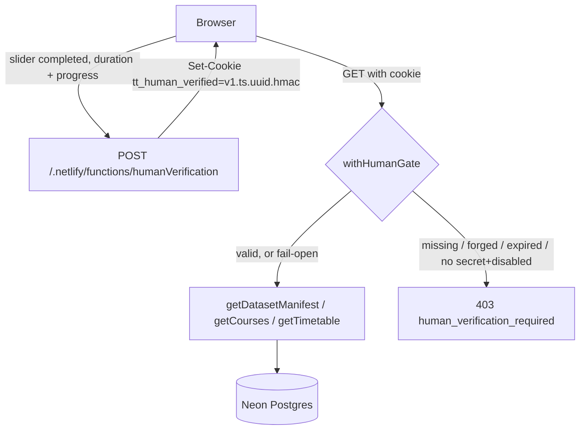

# Handoff — Human-Gate Hardening and Static-Fallback Retirement

**Date:** 2026-09-04
**Repo:** `C:\Projects\tunniplaan` (branch `dev`, promoted to `main` this session)
**Companion repo:** `C:\Projects\tunniplaanScraping` — changed in the same session; see its
`docs/260904-handoff-gate-hardening-and-fallback-retirement.md`. **Read both.** The security
property established here is only true if the scraper repo stays as it was left.

---

## 1. Current Task Objectives

| | Objective | State |
|---|---|---|
| ✓ | Port a "prove you are human" gate from `survey_maj_dekanaadi_kysitlus` | Done — overlay + enforcement on all three data endpoints |
| ✓ | Delete `unified_courses.json` and disable the static fallback | Done — `STATIC_FALLBACK_ENABLED = false`, file removed, LFS store empty |
| ✓ | Find and remove repetitive code across the codebase | Done — see §4.2 |
| ✓ | Run an ablation experiment to find unpinned behaviour | Done — 25 ablations, one real gap found and closed |
| ✓ | Close the cross-repo bypass the scraper would have re-opened | Done — `publish_to_webapp.py` deleted in the companion repo |
| ✓ | Bring every document in line with what the code now does | Done — 6 files this session, listed in §2 |
| x | Verify the gate against a real Netlify deploy | Not done. Locally verified only. See §5.1 |
| x | Decide whether the ~50-line dead fallback subsystem in `main.js` is removed or kept | Deliberately deferred. See §5.2 |

---

## 2. Current Progress

### Completed this session

**Commit `2ed5146` — the gate and the bypass removal**

- `netlify/functions/lib/humanVerification.js` (new, 217 lines): sign/verify plus the
  `withHumanGate` wrapper.
- `netlify/functions/humanVerification.js` (new, 111 lines): POST-only minting endpoint.
- `getDatasetManifest.js`, `getCourses.js`, `getTimetable.js`: `exports.handler` wrapped in
  `withHumanGate`.
- `index.html` / `main.css` / `main.js`: the slider overlay and its state.
- `unified_courses.json`: removed (`git rm`). `git lfs ls-files` is now empty.
- `main.js`: `STATIC_FALLBACK_ENABLED = false`.
- `scripts/lib/script-support.js` (new, 80 lines): the deduplication landing site.
- `tests/functions/humanVerification.test.js` (new, 270 lines, 30 tests).

**Pending commit at time of writing — the documentation reconciliation**

- `README.md`: 8 stale claims corrected, new `### Human verification` section, Git LFS setup
  steps removed, project tree updated, a do-not-re-commit rule added to Contributors.
- `.gitattributes`: LFS filter line removed; the `*.json`-glob warning comment deliberately
  kept, because the trap outlives the rule.
- `docs/DATA_REFRESH.md`: "the one exception during the observation window" inverted into
  "there is no exception"; Recovery section rewritten.
- `docs/distilled-current-state.md`: Mermaid diagram rebuilt around the gate (this also fixed
  a syntax error — see §4.1); gate added to "What works right now".
- `docs/distilled-how-timetable-logic-works.md`: "Static Fallback Mode" → "No Offline
  Fallback" + "Verification Required".
- `CLAUDE.md`: Data Storage line now carries the do-not-re-add rule.

### Known working (verified this session, not assumed)

```
node --check main.js && node --check course-data.js   -> OK
node --test                                            -> 133 pass, 0 fail
node scripts/contract-test-getcourses.js               -> COURSE CONTRACT OK
                                                          version=b1bc2f1b… courses=1026
                                                          groups=428 pages=6
node scripts/contract-test-gettimetable.js             -> CONTRACT OK: all responses deep-equal
                                                          66919 events, 1026 courses
```

Both contract scripts were run with
`TUNNIPLAAN_DATA_DIR="C:/Users/siyima/OneDrive - Tallinna Tehnikaülikool/M_õppetöö/TunniplaaniAI/26s/data"`.

---

## 3. Key Context

### Tech stack

| Layer | Choice | Constraint that matters |
|---|---|---|
| Frontend | Vanilla JS, no framework, no bundler | There is no interception layer, so the gate cannot be middleware |
| Styling | Tailwind via CDN + `main.css` | — |
| Functions | Netlify, CommonJS | Every top-level `.js` in `netlify/functions/` becomes a public endpoint — hence `lib/` |
| Database | Neon Postgres | `NEON_DATABASE_URL` doubles as the gate's secret source |
| Tests | `node --test` | `node --test tests/` fails on Windows with MODULE_NOT_FOUND. Use bare `node --test` |

### Architecture of the gate



Cookie format: `v1.${epochSeconds}.${randomUUID()}.${base64urlHmac}`. The HMAC covers the
first three segments.

### Gotchas — each of these is a decision, not an accident

1. **The signing secret must be derivable, never random.** Each Netlify function is a separate
   process. A per-process `randomBytes` secret would mint a cookie in one lambda that a
   sibling lambda rejects, producing intermittent 403s that look like a flaky gate. The secret
   is `HUMAN_VERIFICATION_SECRET`, falling back to SHA-256 of `NEON_DATABASE_URL`.
2. **The gate fails open.** If no secret can be derived, requests pass. A missing environment
   variable must not take the public timetable offline for the whole university. Availability
   beat strictness on purpose; `HUMAN_VERIFICATION_ENABLED=false` is the deliberate off switch.
3. **Gated responses are downgraded `public` → `private`.** The Netlify CDN keys on URL, not on
   cookie. One verified visitor would otherwise warm a shared edge cache that then answers
   everyone, ungated. The year-long *browser* cache is kept — that is per-client and harmless.
4. **A 403 mid-session is not "API unavailable".** Treating it that way would have routed the
   tab into the static fallback, which was itself an ungated copy of the dataset. The frontend
   clears its marker and reloads once into the gate.
5. **The slider is UX, not security.** `MIN_DURATION_MS = 250` / `MAX_DURATION_MS = 120000`
   only reject absurd submissions. The signature is the boundary.
6. **`lib/` is load-bearing.** Moving either `humanVerification.js` or `dataset.js` up one
   directory publishes it as an endpoint.

---

## 4. Key Findings

### 4.1 The ablation experiment found exactly one real gap — and it was the gate itself

Method: mechanically neutralise one component, run `node --test`, restore in a `finally`.
An ablation the suite does not notice is either dead code or unpinned behaviour. This measures
what is *asserted*, which is not what coverage tools measure (they measure what is *executed*).

25 ablations. The finding:

> Deleting `withHumanGate` from `netlify/functions/getCourses.js` passed all 127 tests.

Cause: every test called `handleRequest`, which sits *below* the gate by design — that seam
exists so contract tests can exercise the query without the admission check. The consequence
was that the layer protecting the entire dataset was pinned by nothing. Someone could have
deleted it in a refactor and shipped green.

Closed by appending a `// --- the wiring ---` block to
`tests/functions/humanVerification.test.js`: six tests that call `handler` and assert 403
without a pass, non-403 with one, across all three endpoints. Suite went 127 → 133. Re-running
the ablation now fails one test per endpoint, so the new tests are proven non-vacuous.

**Three ablations remained UNNOTICED and are not defects.** Do not "fix" these:

| Ablation | Why no test can catch it |
|---|---|
| `crypto.timingSafeEqual` → `===` | Timing is not assertable in a unit test |
| The `v1` prefix check | The version is *inside* the signed payload, so an altered prefix already fails the HMAC. The explicit check is an early exit, not a control |
| `getSecret` memoisation | SHA-256 is deterministic, so this is a pure optimisation. It is the only reason the test-only `_resetSecret` export exists |

Also verified: ablating the static-fallback subsystem in `main.js` / `course-data.js` fails 6
tests. It is unreachable at runtime but still pinned. See §5.2.

### 4.2 Duplication found and removed

| Duplicate | Copies before | After |
|---|---|---|
| `loadDotEnv` | 4 (`contract-test-getcourses`, `contract-test-gettimetable`, `dev-functions-server`, `run-sql`) | 1 |
| `argValue` | 2 — **and they had diverged** on which flag spelling they accepted | 1, a superset (`--k v` and `--k=v`) |
| `resolveSourceDir` | 2 | 1 (throws rather than exits, so callers keep their own reporting) |
| Self-signed gate pass | 2 | 1 (`humanHeaders()`) |
| `getSql` (memoised Neon client) | 2 | 1, in `lib/dataset.js` |
| Hand-built response literals in `netlify/functions/*.js` | 12 | **0** — all `jsonResponse(...)` |

Left duplicated on purpose: `canonicalize` / `fingerprints` (single caller each — extracting
them would add indirection without removing a maintenance point).

### 4.3 The cross-repo regression (this is the one to remember)

The scraper repo instructed the operator, in four places, to copy `unified_courses.json` back
into this repository after every scrape and commit it. Following that runbook once would have
restored a public, ungated URL serving the entire dataset — silently undoing the whole session,
with nothing in either test suite failing.

`publish_to_webapp.py` is deleted and all four instruction sites now carry an explicit
do-not-reinstate warning. **The gate's value depends on that staying true.**

### 4.4 Documentation drift is not cosmetic

`docs/distilled-current-state.md` contained `Client -.->"API Unavailable Fallback"| Rollback`
— missing the opening `|`. Mermaid is all-or-nothing per diagram: one malformed edge renders
the *entire* flowchart as nothing. The architecture diagram had been invisible since it was
written, and nobody noticed, which is itself evidence about how the doc was being used.

---

## 5. Incomplete Items (priority-ordered)

### 5.1 — HIGH: the gate has never been verified against a real Netlify deploy

Everything here is local. Three specific things only production can confirm:

1. `Set-Cookie` survives Netlify's function response path with `HttpOnly; SameSite=Lax` intact.
2. Two different lambdas agree on the derived secret — i.e. `NEON_DATABASE_URL` is
   byte-identical across function environments. If it is not, users will see random 403s.
3. The `public` → `private` downgrade actually prevents edge caching of a gated response.

Verify on `dev--taltech-tunniplaan.netlify.app` before trusting production.

### 5.2 — MEDIUM: the dead static-fallback subsystem in `main.js` / `course-data.js`

~50 lines that cannot execute (`STATIC_FALLBACK_ENABLED = false`) but are pinned by 6 tests.
Kept deliberately: it is still the documented rollback lever, and deleting live-looking code
plus its tests in the same change as a security fix muddies the diff. **Decide explicitly next
session** — either delete it with its tests, or add a comment stating it is intentionally
retained. Half-dead code with passing tests is the worst of both.

### 5.3 — MEDIUM: `HUMAN_VERIFICATION_SECRET` is not set in Netlify

The gate is running on the `NEON_DATABASE_URL` derivation. That works, but it couples the
gate's secret to the database credential: rotating the connection string invalidates every
outstanding pass, logging out every user mid-session. Set an explicit secret before the next
credential rotation.

### 5.4 — LOW: `index.html` header date still shows deploy time, not `scraping_datetime`

Pre-existing, listed in `docs/distilled-current-state.md` under "Known issues to fix". More
visible now that a scrape never triggers a deploy — the two dates can now diverge indefinitely.

---

## 6. Suggested Handoff Path

**Read, in this order:**

1. `netlify/functions/lib/humanVerification.js` — the whole security model is 217 lines
2. `tests/functions/humanVerification.test.js`, specifically the `// --- the wiring ---` block
   at the end — the only tests that pin the gate to the endpoints
3. `README.md` § "Human verification" and § "Data: what lives where"
4. The companion repo's handoff — the bypass is cross-repo

**Verify (all four must pass before any change to the data layer):**

```bash
cd /c/Projects/tunniplaan
node --check main.js && node --check course-data.js
node --test                      # expect 133 pass, 0 fail; NOT `node --test tests/`
TUNNIPLAAN_DATA_DIR="C:/Users/siyima/OneDrive - Tallinna Tehnikaülikool/M_õppetöö/TunniplaaniAI/26s/data" \
  node scripts/contract-test-getcourses.js
TUNNIPLAAN_DATA_DIR="C:/Users/siyima/OneDrive - Tallinna Tehnikaülikool/M_õppetöö/TunniplaaniAI/26s/data" \
  node scripts/contract-test-gettimetable.js
```

**Recommended next action:** §5.1. Deploy to `dev` and confirm cookie round-trip plus
cross-lambda secret agreement. Everything else is refinement of something already believed to
work; that is the one thing not yet known to work.

---

## 7. Risks and Notes

- **Re-committing any full dataset dump silently defeats the gate.** No test fails. No lint
  fires. The rule is written in `README.md` Contributors, `CLAUDE.md`, and `.gitattributes`
  because that is the only enforcement there is.
- **The gate fails open by design.** If someone reads the code expecting fail-closed and
  "fixes" it, a missing env var takes the timetable down for the whole university. If the
  threat model ever changes to justify fail-closed, that is a deliberate decision requiring an
  alerting story first.
- **Do not move `lib/` files up a directory.** Netlify would publish `humanVerification.js`'s
  signing internals as a live endpoint.
- **Do not add tests that call `handler` for query behaviour.** The `handleRequest` seam is
  what keeps query tests independent of the admission check. The six `handler` tests exist
  solely to pin the wiring, and should stay minimal.
- **`node --test tests/` is a trap on Windows** — MODULE_NOT_FOUND. Bare `node --test` is what
  `npm test` runs.
- **CRLF/LF:** `main.js` is CRLF. Everything touched this session is LF. Check before bulk
  edits; a whole-file ending flip will bury the real diff.
- **`git rm` removed `unified_courses.json` from deploys, not from history.** The object is
  still at `e28c72b`. That is the intended recovery path, but it also means the file is not
  *gone* — anyone with repo access can retrieve it. This protects against anonymous scraping,
  not against a repository leak.

---

## 8. Suggested First Step for the Next Agent

```bash
cd /c/Projects/tunniplaan
git checkout dev && git pull
node --test          # must be 133 pass, 0 fail before you change anything

# Then §5.1: deploy dev, open the site, and check in DevTools that
#   1. POST /.netlify/functions/humanVerification returns Set-Cookie with HttpOnly + SameSite=Lax
#   2. a subsequent getCourses page returns 200, and its Cache-Control says `private`
#   3. reloading twice does not re-prompt (the 12h cookie is being honoured)
# If (2) shows `public`, the downgrade is not reaching the CDN and the gate is bypassable
# via a warm edge cache. That is a stop-everything finding.
```
