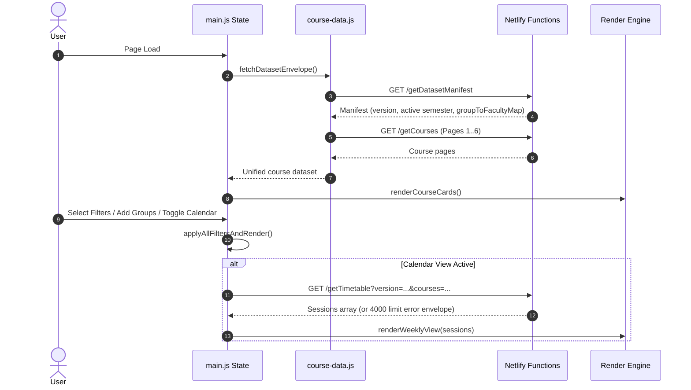

# Distilled How Timetable Logic Works — TalTech Tunniplaan

## Core Concept

The timetable engine resolves, aggregates, and renders course timetable sessions for any arbitrary combination of search filters or selected student groups. It transforms tabular academic scheduling data stored in Neon Postgres into two synchronized UI presentations: an interactive course card grid grouped by delivery mode and a calendar weekly schedule.

---

## Algorithm / Workflow Process

---

## Key Parameters and Signals

### Session Status Classification
Sessions and courses are classified into three delivery categories:

| Status | Rule / Input Condition | UI Visual Marker |
|---|---|---|
| `online` | All session weeks have `is_veebiope = true` | Pink left border / tag |
| `offline` | All session weeks have `is_veebiope = false` | Gray left border / tag |
| `hybrid` | Combination of online and offline weeks | Blue left border / tag |

### Study Week Calculation (`week1_monday`)
- The backend determines `week1_monday` by majority vote over dated sessions.
- Client-side date math calculates active study week numbers based on offsets from `week1_monday`.

### Server-Side Session Safeguard Limit
- `getTimetable.js` enforces a limit of **4,000 sessions** per calendar query to protect memory and network payload bounds.
- When query parameters match >4,000 sessions, the endpoint returns `{ error: "limit_exceeded", count, limit }` (HTTP 200) instead of a truncated array.

---

## View Breakdown & Rendering Modes

### 1. Course Card Grid
- Courses are grouped into three collapsible sections: Online, Hybrid, Offline.
- Sorted deterministically by course code within each group.
- Displays course EAP, assessment form, instructor list (filtered by active group if group filter is active), and matching study group badges.

### 2. Weekly Calendar Grid
- Time grid rendered from 08:00 to 22:00 (Monday through Saturday).
- Timed events with fixed rooms and dates populate grid cells dynamically based on start/end times.
- Online-only courses (without fixed room/time slots) render in a dedicated banner above the main time grid.

### 3. Multi-Group Timetable Builder
- Allows entering multiple comma-separated groups (e.g. `IADB11, TVTB11`).
- Supports wildcard prefix matching (e.g. `TVTB*` expands to all groups starting with `TVTB`).
- Serializes chip state into URL query parameters for bookmarking and sharing.

---

## Backend Services & Infrastructure

- **Neon Postgres**: Relational store containing `semesters`, `groups`, `courses`, and `sessions` tables.
- **Netlify Functions**:
  - `getDatasetManifest.js`: Serves manifest, semester metadata, and faculty mapping.
  - `getCourses.js`: Returns paged course summaries.
  - `getTimetable.js`: Executes SQL query over `sessions` table filtered by course IDs / semester code.

---

## Known Limitations

- **Session Query Cap**: If an active filter set matches more than 4,000 sessions, the calendar view prompts the user to refine filters rather than displaying partial results.
- **No Offline Fallback**: If the serverless functions fail or are unavailable, the application shows a load error rather than degrading to static data. `STATIC_FALLBACK_ENABLED` in `main.js` is `false` and `unified_courses.json` is no longer deployed: a committed dataset would be a public URL serving in full what the human-verification gate exists to withhold. An outage is visible rather than silently stale.
- **Verification Required**: Every data endpoint answers `403 human_verification_required` without a valid signed `tt_human_verified` cookie. A `403` arriving mid-session is not treated as an outage — the frontend clears its marker and reloads once into the gate.
