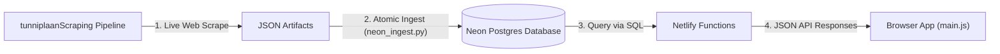

# Distilled How to Run — TalTech Tunniplaan

## Start the app locally

### Supported Local Development Mode (Functions + Neon Data)

The application fetches course data and timetable sessions through serverless functions. Run the local Node.js dev server:

```bash
# Ensure NEON_DATABASE_URL is set in .env
node scripts/dev-functions-server.js
```

- Server runs on `http://localhost:8000`.
- Reads `NEON_DATABASE_URL` from `.env` in the repository root.
- Handles function endpoints: `/.netlify/functions/getDatasetManifest`, `/.netlify/functions/getCourses`, and `/.netlify/functions/getTimetable`.

### Unsupported / Static-Only Commands

- `npm run dev`: Static file server only. Functions do not run in this mode, causing the application to show a data load error. Useful only for rapid CSS editing.
- `npm run dev:netlify`: Expands to `npx netlify dev`. Cannot be executed on environments where `npx` is restricted by group policy.

---

## Environment Variables

| Variable | Purpose | Where to Get It |
|---|---|---|
| `NEON_DATABASE_URL` | Read-only connection string for querying Neon Postgres | Neon Console / Team secrets manager |
| `NEON_SCRAPER_URL` | Read-write connection string used by scraper ingests | Neon Console / Team secrets manager |

Put these variables in `.env` in the repository root. Do not commit `.env` to Git.

---

## Data Pipeline



---

## Build and Deploy

- **Production Deployment**: Merging code into `main` automatically triggers a production build on Netlify.
- **Preview Deployment**: Merging or pushing to `dev` creates a Netlify deploy preview URL.
- **Data Refresh**: Data updates do **not** require a build or deployment. Running `neon_ingest.py` in `tunniplaanScraping` updates Neon Postgres, making new timetable data immediately visible in the live application.

---

## Key Data Shape

### Semester Metadata (`getDatasetManifest`)
```json
{
  "code": "26s",
  "label": "2026/2027 sügis",
  "name_et": "sügis 2026",
  "name_en": "autumn 2026",
  "start_date": "2026-08-27",
  "end_date": "2027-01-15",
  "week1_monday": "2026-08-31",
  "dataset_version": "b1bc2f1b5e3915d2b2da32979885564fadae6d6e8b5921224c2f02156e8df2e3",
  "groupToFacultyMap": { "IADB11": "I", "VDLR31": "V" }
}
```

### Course Object (`getCourses`)
```json
{
  "id": "ITI0102",
  "name_et": "Programmeerimise algkursus",
  "name_en": "Introduction to Programming",
  "eap": 6.0,
  "school_code": "I",
  "groups": ["IADB11", "IADB12"],
  "group_sessions": [
    {
      "group": "IADB11",
      "session_status": "hybrid",
      "instructors": [{"name": "Jane Doe", "title": "PhD"}]
    }
  ]
}
```

### Session Event (`getTimetable`)
```json
{
  "course_id": "ITI0102",
  "date": "2026-09-01",
  "start_time": "10:00",
  "end_time": "11:30",
  "type": "Loeng",
  "room": "ICT-315",
  "weeks": "1-16",
  "is_veebiope": false,
  "groups": ["IADB11"]
}
```
